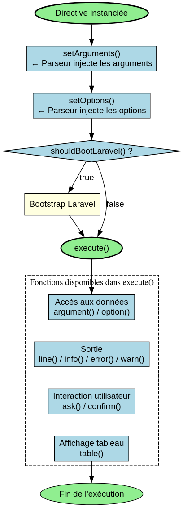

# AbstractDirective - Référence Technique

## Description

Classe abstraite de base pour toutes les directives CLI. Fournit la gestion des arguments et options, les méthodes d'interaction utilisateur, l'affichage de tableaux et le bootstrap optionnel de Laravel.

## Hiérarchie

```
DirectiveInterface
    └── AbstractDirective (abstract)
            └── Toutes les directives concrètes
```

## Rôle principal

Servir de fondation pour toutes les directives CLI. Encapsule la logique commune de gestion des arguments, des options, des interactions utilisateur et du bootstrap Laravel. Chaque directive concrète doit implémenter `getSignature()`, `getDescription()` et `execute()`.

## Installation

```bash
composer require andydefer/laravel-directive
```

## API / Méthodes publiques

### `getBlueprint(): DirectiveBlueprintRecord`

Retourne l'enregistrement blueprint contenant les métadonnées de la directive.

**Retourne :** `DirectiveBlueprintRecord` - Enregistrement avec classe, signature et description

**Exemple :**
```php
$blueprint = $directive->getBlueprint();
// $blueprint->class = 'App\Directives\UserListDirective'
// $blueprint->signature = 'user-list'
// $blueprint->description = 'List all users'
```

### `getAliases(): StringTypedCollection`

Retourne les alias de la directive (noms alternatifs pour l'invoquer).

**Retourne :** `StringTypedCollection` - Collection des alias

**Exemple :**
```php
public function getAliases(): StringTypedCollection
{
    $aliases = new StringTypedCollection();
    $aliases->add('users');
    $aliases->add('list-users');
    return $aliases;
}
```

### `shouldBootLaravel(): bool`

Détermine si Laravel doit être bootstrapé avant l'exécution.

**Retourne :** `bool` - `true` si Laravel est requis, `false` par défaut

**Exemple :**
```php
public function shouldBootLaravel(): bool
{
    return true; // Besoin d'Eloquent ou de la base de données
}
```

### `hasLaravel(): bool`

Vérifie si Laravel a été bootstrapé et est disponible.

**Retourne :** `bool` - `true` si Laravel est disponible

### `getLaravel(): ?object`

Retourne l'instance de l'application Laravel si disponible.

**Retourne :** `object|null` - L'application Laravel ou `null`

### `setLaravelBootstrapper(?LaravelBootstrapper $bootstrapper): self`

Définit l'instance du bootstrapper Laravel.

| Paramètre | Type | Description |
|-----------|------|-------------|
| `$bootstrapper` | `LaravelBootstrapper|null` | L'instance du bootstrapper |

**Retourne :** `self` - L'instance courante pour le chaînage

### `setArguments(ParameterCollection $arguments): self`

Définit les arguments de la directive.

| Paramètre | Type | Description |
|-----------|------|-------------|
| `$arguments` | `ParameterCollection` | Collection des arguments |

**Retourne :** `self` - L'instance courante pour le chaînage

### `argument(string $key): ?string`

Retourne la valeur d'un argument par sa clé. Retourne `null` si l'argument n'existe pas, est vide ou est un booléen.

| Paramètre | Type | Description |
|-----------|------|-------------|
| `$key` | `string` | Nom de l'argument |

**Retourne :** `string|null` - Valeur de l'argument ou `null`

**Exemple :**
```php
$name = $this->argument('name'); // 'John Doe'
```

### `hasArgument(string $key): bool`

Vérifie si un argument existe et a une valeur non vide.

| Paramètre | Type | Description |
|-----------|------|-------------|
| `$key` | `string` | Nom de l'argument |

**Retourne :** `bool` - `true` si l'argument existe et a une valeur non vide

### `setOptions(ParameterCollection $options): self`

Définit les options de la directive.

| Paramètre | Type | Description |
|-----------|------|-------------|
| `$options` | `ParameterCollection` | Collection des options |

**Retourne :** `self` - L'instance courante pour le chaînage

### `option(string $key): bool|string|null`

Retourne la valeur d'une option par sa clé. Retourne `bool` pour les flags (`--force`), `string` pour les options avec valeur (`--role=admin`), `null` si non fournie.

| Paramètre | Type | Description |
|-----------|------|-------------|
| `$key` | `string` | Nom de l'option |

**Retourne :** `bool|string|null` - Valeur de l'option

**Exemple :**
```php
$force = $this->option('force');   // true si --force présent
$role = $this->option('role');     // 'admin' si --role=admin
```

### `hasOption(string $key): bool`

Vérifie si une option existe et a une valeur non vide.

| Paramètre | Type | Description |
|-----------|------|-------------|
| `$key` | `string` | Nom de l'option |

**Retourne :** `bool` - `true` si l'option existe et a une valeur non vide

### `line(string $message): void`

Affiche un message texte brut.

**Exemple :**
```php
$this->line('Processing users...');
```

### `info(string $message): void`

Affiche un message d'information (généralement en vert).

**Exemple :**
```php
$this->info('Operation completed successfully!');
```

### `error(string $message): void`

Affiche un message d'erreur (généralement en rouge).

**Exemple :**
```php
$this->error('Failed to connect to database.');
```

### `warn(string $message): void`

Affiche un message d'avertissement (généralement en jaune).

**Exemple :**
```php
$this->warn('This operation may take a while.');
```

### `ask(string $question): string`

Pose une question et retourne la réponse de l'utilisateur.

| Paramètre | Type | Description |
|-----------|------|-------------|
| `$question` | `string` | La question à poser |

**Retourne :** `string` - La réponse saisie

**Exemple :**
```php
$name = $this->ask('What is your name?');
```

### `confirm(string $question): bool`

Demande une confirmation et retourne le choix de l'utilisateur.

| Paramètre | Type | Description |
|-----------|------|-------------|
| `$question` | `string` | La question de confirmation |

**Retourne :** `bool` - `true` si l'utilisateur confirme (y/yes)

**Exemple :**
```php
if ($this->confirm('Do you want to continue?')) {
    // Continuer
}
```

### `table(StringTypedCollection $headers, RowCollection $rows): void`

Affiche un tableau formaté avec en-têtes et lignes.

| Paramètre | Type | Description |
|-----------|------|-------------|
| `$headers` | `StringTypedCollection` | Les en-têtes du tableau |
| `$rows` | `RowCollection` | Les lignes du tableau |

**Exemple :**
```php
$headers = new StringTypedCollection();
$headers->add('ID', 'Name', 'Email');

$rows = new RowCollection();
$row = new RowCollection();
$row->add(1, 'John Doe', 'john@example.com');
$rows->add($row);

$this->table($headers, $rows);
```

## Cas d'utilisation

### Cas 1 : Directive avec arguments et options

```php
final class UserCreateDirective extends AbstractDirective
{
    public function getSignature(): string
    {
        return 'user-create {name} {email} {--role=user} {--notify}';
    }

    public function getDescription(): string
    {
        return 'Create a new user account';
    }

    public function execute(): ExitCode
    {
        $name = $this->argument('name');
        $email = $this->argument('email');
        $role = $this->option('role');
        $notify = $this->option('notify');

        $this->info("User {$name} created with role {$role}");

        if ($notify) {
            $this->info("Notification sent to {$email}");
        }

        return ExitCode::SUCCESS;
    }
}
```

### Cas 2 : Directive interactive

```php
final class SetupDirective extends AbstractDirective
{
    public function getSignature(): string
    {
        return 'app-setup';
    }

    public function getDescription(): string
    {
        return 'Interactive application setup wizard';
    }

    public function execute(): ExitCode
    {
        $this->info('Welcome to the setup wizard!');

        $appName = $this->ask('Application name');
        $environment = $this->ask('Environment (local/production)');

        if (!$this->confirm("Create configuration for {$appName} in {$environment}?")) {
            $this->warn('Setup cancelled');
            return ExitCode::SUCCESS;
        }

        $headers = new StringTypedCollection();
        $headers->add('Setting', 'Value');

        $rows = new RowCollection();
        $row = new RowCollection();
        $row->add('App Name', $appName);
        $row->add('Environment', $environment);
        $rows->add($row);

        $this->table($headers, $rows);
        $this->info('Setup completed successfully!');

        return ExitCode::SUCCESS;
    }
}
```

### Cas 3 : Directive avec Laravel (base de données)

```php
final class UserStatsDirective extends AbstractDirective
{
    public function getSignature(): string
    {
        return 'user-stats';
    }

    public function getDescription(): string
    {
        return 'Display user statistics from database';
    }

    public function shouldBootLaravel(): bool
    {
        return true; // Besoin d'Eloquent
    }

    public function execute(): ExitCode
    {
        if (!$this->hasLaravel()) {
            $this->error('Laravel is not available!');
            return ExitCode::FAILURE;
        }

        $totalUsers = User::count();
        $this->info("Total users: {$totalUsers}");

        return ExitCode::SUCCESS;
    }
}
```

## Flux d'exécution




## Gestion des erreurs

| Situation | Comportement |
|-----------|--------------|
| Argument inexistant | `argument()` retourne `null`, `hasArgument()` retourne `false` |
| Option inexistante | `option()` retourne `null`, `hasOption()` retourne `false` |
| Laravel non bootstrapé | `hasLaravel()` retourne `false`, `getLaravel()` retourne `null` |
| Exception dans `execute()` | Capturée par `DirectiveExecutionService`, retourne `ExitCode::FAILURE` |

## Intégration

`AbstractDirective` s'intègre avec :

- **`DirectiveInteractionService`** : Gère l'affichage et les interactions utilisateur
- **`LaravelBootstrapper`** : Bootstrap optionnel de Laravel
- **`ParameterCollection`** : Stockage typé des arguments et options
- **`RowCollection`** : Collection pour les lignes de tableau
- **`StringTypedCollection`** : Collection pour les chaînes (en-têtes, alias)

## Performance

| Aspect | Caractéristique |
|--------|----------------|
| Arguments/Options | Accès O(n) avec n = nombre d'éléments |
| Affichage | Délégation à `DirectiveInteractionService` |
| Bootstrap Laravel | Une seule fois par exécution (si nécessaire) |
| Mémoire | Une instance par exécution de directive |

## Compatibilité

| Version | Support |
|---------|---------|
| PHP 8.1+ | ✅ Requis (readonly properties, union types) |
| PHP 8.2+ | ✅ Complet |
| PHP 8.3+ | ✅ Complet |
| Laravel 10+ | ✅ Complet (bootstrap optionnel) |

## Exemple complet

```php
<?php

declare(strict_types=1);

namespace App\Directives;

use AndyDefer\Directive\AbstractDirective;
use AndyDefer\Directive\Enums\ExitCode;
use AndyDefer\Directive\Collections\RowCollection;
use AndyDefer\DomainStructures\Collections\Utility\StringTypedCollection;

final class UserListDirective extends AbstractDirective
{
    public function getSignature(): string
    {
        return 'user-list {--role=} {--active} {--limit=10}';
    }

    public function getDescription(): string
    {
        return 'List users with optional filters';
    }

    public function getAliases(): StringTypedCollection
    {
        $aliases = new StringTypedCollection();
        $aliases->add('users');
        return $aliases;
    }

    public function execute(): ExitCode
    {
        $role = $this->option('role');
        $active = $this->option('active');
        $limit = (int) $this->option('limit') ?: 10;

        $this->info("Listing users (limit: {$limit})");

        if ($role) {
            $this->info("Filtering by role: {$role}");
        }

        if ($active !== null) {
            $this->info("Filtering by active: " . ($active ? 'yes' : 'no'));
        }

        $headers = new StringTypedCollection();
        $headers->add('ID', 'Name', 'Email', 'Role', 'Status');

        $rows = new RowCollection();
        // Récupérer les utilisateurs (simulé)
        $users = [
            ['id' => 1, 'name' => 'John Doe', 'email' => 'john@example.com', 'role' => 'admin', 'active' => true],
        ];

        foreach ($users as $user) {
            $row = new RowCollection();
            $row->add(
                $user['id'],
                $user['name'],
                $user['email'],
                $user['role'],
                $user['active'] ? 'Active' : 'Inactive'
            );
            $rows->add($row);
        }

        $this->table($headers, $rows);
        $this->info('Users listed successfully!');

        return ExitCode::SUCCESS;
    }
}
```
---