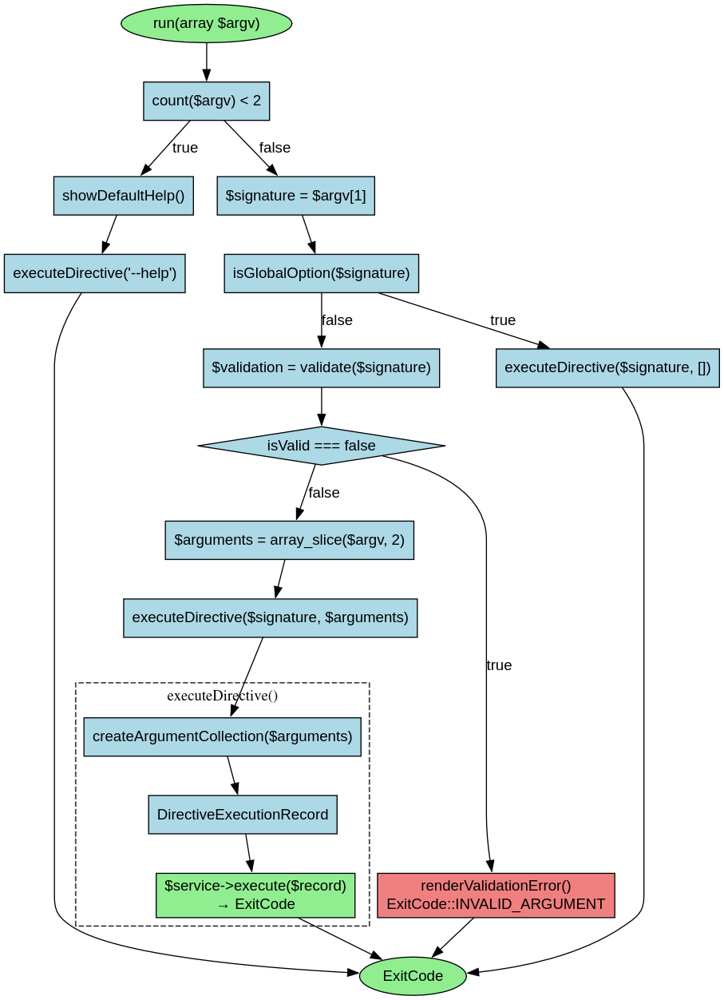

# DirectiveKernel - Référence Technique

## Description

Point d'entrée principal de l'application CLI. Analyse les arguments bruts de la ligne de commande, valide les signatures des directives et délègue l'exécution au service approprié.

## Hiérarchie

```
DirectiveKernel (final)
    └── Dépend de : DirectiveExecutionService, SignatureValidationService, DirectiveRendererService
```

## Rôle principal

Orchestrer l'exécution des directives en ligne de commande. Il parse les arguments, identifie la directive à exécuter, valide sa signature et gère les options globales (--help, --list, --version).

## Installation

```bash
composer require andydefer/laravel-directive
```

## API / Méthodes publiques

### `run(array $argv): ExitCode`

Exécute le kernel avec les arguments de ligne de commande donnés.

| Paramètre | Type | Description |
|-----------|------|-------------|
| `$argv` | `array<int, string>` | Arguments de ligne de commande (ex: `['directive', 'user:create', 'John']`) |

**Retourne :** `ExitCode` - Code de sortie indiquant le succès ou l'échec

**Exemple :**
```php
$kernel = new DirectiveKernel($executionService, $validator, $renderer);
$exitCode = $kernel->run(['directive', 'user-list', '--verbose']);
```

## Méthodes privées (documentation interne)

### `isGlobalOption(string $signature): bool`

Vérifie si la signature est une option globale CLI.

| Paramètre | Type | Description |
|-----------|------|-------------|
| `$signature` | `string` | Signature ou option de directive |

**Retourne :** `bool` - True si c'est une option globale (`--help`, `-h`, `--list`, `-l`, `--version`, `-v`)

### `executeDirective(string $signature, array $arguments): ExitCode`

Exécute une directive avec la signature et les arguments donnés.

### `createArgumentCollection(array $arguments): StringTypedCollection`

Crée une collection typée à partir d'un tableau d'arguments.

### `showDefaultHelp(): ExitCode`

Affiche l'écran d'aide par défaut lorsqu'aucun argument n'est fourni.

## Cas d'utilisation

### Cas 1 : Exécuter une directive simple

```php
$argv = ['directive', 'user-list'];
$exitCode = $kernel->run($argv);
// Retourne ExitCode::SUCCESS (0) si la directive existe et s'exécute correctement
```

### Cas 2 : Exécuter une directive avec arguments

```php
$argv = ['directive', 'user-create', 'John', 'john@example.com', '--role=admin'];
$exitCode = $kernel->run($argv);
```

### Cas 3 : Afficher l'aide globale

```php
$argv = ['directive', '--help'];
$exitCode = $kernel->run($argv);
// Affiche l'aide complète, retourne ExitCode::SUCCESS
```

### Cas 4 : Lister toutes les directives disponibles

```php
$argv = ['directive', '--list'];
$exitCode = $kernel->run($argv);
// Affiche la liste des directives, retourne ExitCode::SUCCESS
```

### Cas 5 : Gérer une signature invalide

```php
$argv = ['directive', 'create@user']; // Caractère '@' interdit
$exitCode = $kernel->run($argv);
// Affiche une erreur de validation, retourne ExitCode::INVALID_ARGUMENT (4)
```

## Flux d'exécution



## Gestion des erreurs

| Situation | Exception/Condition | Code de sortie |
|-----------|---------------------|----------------|
| Aucun argument fourni | Affiche l'aide par défaut | `ExitCode::SUCCESS` |
| Signature invalide (caractères interdits) | `ValidationResultRecord::isValid = false` | `ExitCode::INVALID_ARGUMENT` |
| Directive non trouvée | `$directiveMetadata === null` | `ExitCode::NOT_FOUND` (3) |
| Échec d'exécution de la directive | `$result !== ExitCode::SUCCESS` | Variable (1, 3 ou 4) |
| Exception pendant l'exécution | `catch (\Throwable $e)` | `ExitCode::FAILURE` (1) |

## Intégration

`DirectiveKernel` s'intègre avec :

- **`DirectiveExecutionService`** : Exécute la directive après parsing et validation
- **`SignatureValidationService`** : Valide le format des signatures
- **`DirectiveRendererService`** : Affiche les messages, erreurs, tableaux et validations
- **`StringTypedCollection`** : Collection typée pour les arguments
- **`DirectiveExecutionRecord`** : Enregistrement des données d'exécution

## Performance

| Aspect | Caractéristique |
|--------|----------------|
| Parsing des arguments | O(n) avec n = nombre d'arguments |
| Validation de signature | O(1) (expression régulière simple) |
| Mémoire | Une instance par appel, rapidement libérée |
| Pas de cache | Aucun mécanisme de cache interne |

## Compatibilité

| Version | Support |
|---------|---------|
| PHP 8.1+ | ✅ Requis (readonly properties, union types) |
| PHP 8.2+ | ✅ Complet |
| PHP 8.3+ | ✅ Complet |
| Laravel 10+ | ✅ Complet (pour les directives Laravel) |

## Exemple complet

```php
<?php

declare(strict_types=1);

use AndyDefer\Directive\DirectiveKernel;
use AndyDefer\Directive\Enums\ExitCode;
use AndyDefer\Directive\Services\DirectiveExecutionService;
use AndyDefer\Directive\Services\DirectiveRendererService;
use AndyDefer\Directive\Services\SignatureValidationService;

// 1. Instancier les dépendances
$executionService = new DirectiveExecutionService($discovery, $parser, $hydrator, $renderer);
$signatureValidator = new SignatureValidationService();
$renderer = new DirectiveRendererService($renderTask);

// 2. Créer le kernel
$kernel = new DirectiveKernel($executionService, $signatureValidator, $renderer);

// 3. Exécuter une directive
$argv = ['directive', 'user-list', '--verbose'];
$exitCode = $kernel->run($argv);

// 4. Vérifier le résultat
if ($exitCode === ExitCode::SUCCESS) {
    echo "Directive executed successfully\n";
} else {
    echo "Directive failed with code: " . $exitCode->value . "\n";
}
```
---