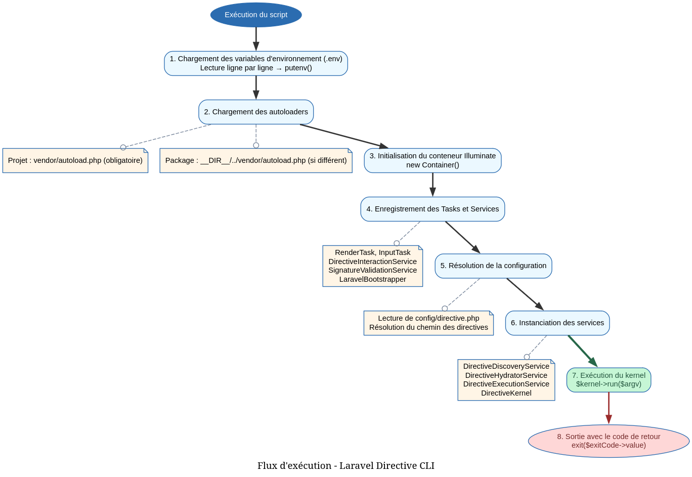

# Directive CLI - Référence Technique

## Description

Point d'entrée principal de l'application CLI Laravel Directive. Bootstrap l'environnement, charge les autoloaders, initialise le conteneur d'injection de dépendances et exécute la directive demandée.

## Rôle principal

Servir de script exécutable (`./vendor/bin/directive`) qui orchestre le chargement de l'application, la résolution des dépendances et l'exécution des directives CLI. Gère le chargement des variables d'environnement, la découverte des autoloaders et la configuration personnalisée.

## Installation

```bash
composer require andydefer/laravel-directive
```

Le script est automatiquement disponible dans `./vendor/bin/directive`.

## Utilisation

```bash
# Afficher l'aide
./vendor/bin/directive --help

# Lister toutes les directives disponibles
./vendor/bin/directive --list

# Exécuter une directive
./vendor/bin/directive user-list --verbose

# Exécuter une directive avec arguments
./vendor/bin/directive user-create "John Doe" john@example.com --role=admin

# Afficher la version
./vendor/bin/directive --version
```

## Flux d'exécution



## Gestion des erreurs

| Situation | Comportement | Code de sortie |
|-----------|--------------|----------------|
| Autoloader non trouvé | Message d'erreur + exit(1) | 1 |
| Fichier de configuration manquant | Utilise le chemin par défaut (`app/Directives`) | - |
| Directive non trouvée | Message "not found" + exit(3) | 3 |
| Signature invalide | Message d'erreur + exit(4) | 4 |
| Exception non capturée | Message d'erreur + exit(1) | 1 |

## Configuration

### Fichier de configuration `config/directive.php`

```php
<?php

return [
    /*
    |--------------------------------------------------------------------------
    | Directives Path
    |--------------------------------------------------------------------------
    |
    | This option defines where your directive classes are located.
    |
    */
    'path' => getcwd() . '/app/Directives',
];
```

### Variables d'environnement

| Variable | Description |
|----------|-------------|
| `DIRECTIVE_DEBUG` | Active le mode debug (`true`/`false`) |

## Dépendances chargées

| Service | Rôle |
|---------|------|
| `DirectiveKernel` | Orchestrateur principal |
| `DirectiveExecutionService` | Exécution des directives |
| `DirectiveDiscoveryService` | Découverte des directives |
| `DirectiveParserService` | Parsing des signatures |
| `DirectiveHydratorService` | Hydratation des instances |
| `DirectiveRendererService` | Rendu des sorties |
| `LaravelBootstrapper` | Bootstrap optionnel de Laravel |
| `SignatureValidationService` | Validation des signatures |

## Performance

| Aspect | Caractéristique |
|--------|----------------|
| Bootstrap | Une fois par exécution |
| Conteneur | Singleton pour les services réutilisables |
| Découverte | Mise en cache des packages scannés |
| Mémoire | Libérée après l'exécution |

## Compatibilité

| Version | Support |
|---------|---------|
| PHP 8.1+ | ✅ Requis |
| Laravel 10+ | ✅ Optionnel (via bootstrapper) |
| Composer | ✅ Requis pour l'autoloading |

## Exemple complet

```bash
# Créer une nouvelle directive
$ ./vendor/bin/directive make-directive user-list

# Afficher la liste des directives
$ ./vendor/bin/directive --list

Available Directives
━━━━━━━━━━━━━━━━━━━━━━━━━━━━━━━━━━━━━━━━━━━━━━━━━━━━━━━━━━━━
  user-list (App\Directives\UserListDirective)
    List all users
━━━━━━━━━━━━━━━━━━━━━━━━━━━━━━━━━━━━━━━━━━━━━━━━━━━━━━━━━━━━

# Exécuter une directive avec options
$ ./vendor/bin/directive user-list --role=admin --verbose

Listing users with role: admin
Verbose mode enabled
Users listed successfully!

# Afficher l'aide d'une directive
$ ./vendor/bin/directive user-list --help

Usage:
  user-list [options]

Options:
  --role=     Filter by role
  --verbose   Enable verbose output

Description:
  List all users with optional filters
```

## Voir aussi

- [`DirectiveKernel`](directive-kernel.md) - Noyau d'exécution
- [`DirectiveExecutionService`](directive-execution-service.md) - Service d'exécution
- [`DirectiveConfig`](directive-config.md) - Configuration des chemins
- [`LaravelBootstrapper`](laravel-bootstrapper.md) - Bootstrap de Laravel
- [`RenderTask`](./tasks/render-task.md) - Tâche de rendu
- [`InputTask`](./tasks/input-task.md) - Tâche d'entrée utilisateur