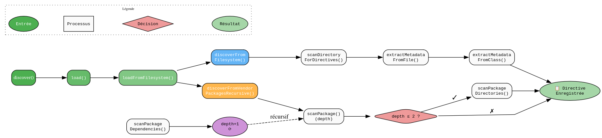

# DirectiveDiscoveryService - Référence Technique

## Description

Service responsable de la découverte automatique des directives dans le système de fichiers et les packages vendor. Scanne les dossiers configurés, les dépendances Composer et extrait les métadonnées des directives valides.

## Hiérarchie

```
DirectiveLoaderInterface
    └── DirectiveDiscoveryService (final)
```

## Rôle principal

Découvrir automatiquement toutes les directives disponibles dans l'application et les packages installés. Gère la découverte récursive dans les dépendances Composer (profondeur max 2), l'extraction des métadonnées et le bootstrap optionnel de Laravel pour les directives qui en ont besoin.

## Installation

```bash
composer require andydefer/laravel-directive
```

## API / Méthodes publiques

### `discover(): DirectiveMetadataCollection`

Découvre toutes les directives disponibles.

**Retourne :** `DirectiveMetadataCollection` - Collection des métadonnées des directives

**Exemple :**
```php
$discovery = new DirectiveDiscoveryService($config, $hydrator);
$directives = $discovery->discover();
echo "Found " . $directives->count() . " directives";
```

### `load(): DirectiveMetadataCollection`

Charge les directives depuis le système de fichiers.

**Retourne :** `DirectiveMetadataCollection` - Collection des métadonnées des directives

### `setLoader(DirectiveLoaderInterface $loader): void`

Définit un chargeur personnalisé.

| Paramètre | Type | Description |
|-----------|------|-------------|
| `$loader` | `DirectiveLoaderInterface` | Chargeur personnalisé |

### `setLaravelBootstrapper(?LaravelBootstrapper $bootstrapper): void`

Définit le bootstrapper Laravel pour les directives qui en ont besoin.

| Paramètre | Type | Description |
|-----------|------|-------------|
| `$bootstrapper` | `LaravelBootstrapper|null` | Instance du bootstrapper |

## Cas d'utilisation

### Cas 1 : Découverte des directives de l'application

```php
$config = DirectiveConfig::default()->withDirectivesPath('/app/Directives');
$discovery = new DirectiveDiscoveryService($config, $hydrator);

$directives = $discovery->discover();

foreach ($directives as $directive) {
    echo $directive->signature . ': ' . $directive->description . "\n";
}
```

### Cas 2 : Découverte avec bootstrap Laravel

```php
$bootstrapper = new LaravelBootstrapper();
$discovery->setLaravelBootstrapper($bootstrapper);

$directives = $discovery->discover();
// Les directives qui nécessitent Laravel (shouldBootLaravel = true)
// seront exécutées avec un environnement Laravel bootstrappé
```

### Cas 3 : Utilisation d'un chargeur personnalisé

```php
$customLoader = new TestDirectiveRegistry();
$discovery->setLoader($customLoader);

$directives = $discovery->discover(); // Utilise le chargeur personnalisé
```

## Flux d'exécution


## Gestion des erreurs

| Situation | Comportement |
|-----------|--------------|
| Classe abstraite | Ignorée, non ajoutée à la collection |
| Classe n'étendant pas `AbstractDirective` | Ignorée |
| Fichier PHP malformé | Ignoré, ne cause pas d'exception |
| Composer.json introuvable | Arrêt de la découverte des packages |
| Package vendor introuvable | Ignoré, continue avec le suivant |
| Exception pendant l'extraction | Ignorée, continue avec le fichier suivant |

## Intégration

`DirectiveDiscoveryService` s'intègre avec :

- **`DirectiveConfig`** : Configuration du chemin des directives
- **`DirectiveHydratorService`** : Hydratation des métadonnées
- **`LaravelBootstrapper`** : Bootstrap optionnel de Laravel
- **`DirectiveLoaderInterface`** : Interface pour les chargeurs personnalisés
- **`DirectiveMetadataRecord`** : Métadonnées d'une directive

## Performance

| Aspect | Caractéristique |
|--------|----------------|
| Scan initial | O(n × m) avec n = fichiers, m = packages |
| Cache des packages scannés | Évite les scans en double (tableau `$scannedPackages`) |
| Découverte récursive | Limite à profondeur 2 pour performances |
| Bootstrap Laravel | Une seule fois pour toutes les directives |

## Compatibilité

| Version | Support |
|---------|---------|
| PHP 8.1+ | ✅ Requis |
| Laravel 10+ | ✅ Optionnel (via bootstrapper) |
| Composer | ✅ Requis pour la découverte des packages |

## Exemple complet

```php
<?php

declare(strict_types=1);

use AndyDefer\Directive\Config\DirectiveConfig;
use AndyDefer\Directive\Factories\ContainerDirectiveFactory;
use AndyDefer\Directive\Services\DirectiveDiscoveryService;
use AndyDefer\Directive\Services\DirectiveHydratorService;
use Illuminate\Container\Container;

// 1. Configurer le chemin des directives
$config = DirectiveConfig::default()->withDirectivesPath(__DIR__ . '/app/Directives');

// 2. Créer le conteneur et les services
$container = new Container();
$factory = new ContainerDirectiveFactory($container);
$hydrator = new DirectiveHydratorService($factory);

// 3. Créer le service de découverte
$discovery = new DirectiveDiscoveryService($config, $hydrator);

// 4. Découvrir les directives
$directives = $discovery->discover();

// 5. Afficher les résultats
echo "Found " . $directives->count() . " directives:\n";
foreach ($directives as $directive) {
    echo sprintf(
        "  - %s (%s)\n    %s\n",
        $directive->signature,
        $directive->class,
        $directive->description
    );
}
```
---