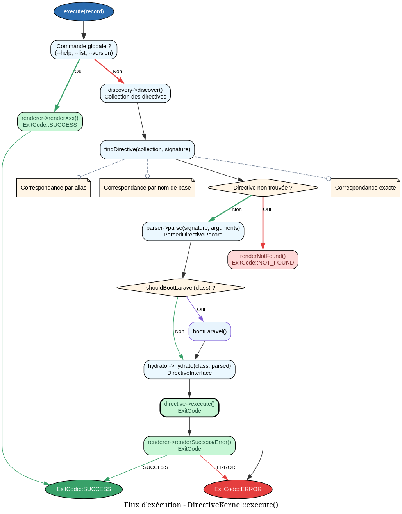

# DirectiveExecutionService - Référence Technique

## Description

Service central responsable de l'exécution complète des directives CLI. Orchestre la découverte, la recherche, le parsing, l'hydratation et l'exécution des directives.

## Hiérarchie

```
DirectiveExecutionService (final)
    ├── Dépend de : DirectiveDiscoveryService
    ├── Dépend de : DirectiveParserService
    ├── Dépend de : DirectiveHydratorService
    └── Dépend de : DirectiveRendererService
```

## Rôle principal

Exécuter une directive à partir d'un enregistrement d'exécution. Gère les commandes globales (`--help`, `--list`, `--version`), trouve la directive cible par signature, alias ou nom de base, parse les arguments, bootstrappe Laravel si nécessaire, hydrate l'instance et exécute la directive.

## Installation

```bash
composer require andydefer/laravel-directive
```

## API / Méthodes publiques

### `execute(DirectiveExecutionRecord $record): ExitCode`

Exécute une directive à partir de l'enregistrement d'exécution.

| Paramètre | Type | Description |
|-----------|------|-------------|
| `$record` | `DirectiveExecutionRecord` | Enregistrement contenant la signature et les arguments |

**Retourne :** `ExitCode` - Code de sortie indiquant le succès ou l'échec

**Exceptions :** Aucune (toutes les exceptions sont capturées et traduites en codes de sortie)

**Exemple :**
```php
$arguments = new StringTypedCollection();
$arguments->add('John', '--role=admin');

$record = new DirectiveExecutionRecord(
    signature: 'user-create',
    arguments: $arguments
);

$exitCode = $service->execute($record);
```

### `setLaravelBootstrapper(?LaravelBootstrapper $bootstrapper): void`

Définit le bootstrapper Laravel pour les directives qui en ont besoin.

| Paramètre | Type | Description |
|-----------|------|-------------|
| `$bootstrapper` | `LaravelBootstrapper|null` | Instance du bootstrapper |

## Cas d'utilisation

### Cas 1 : Exécution d'une directive simple

```php
$record = new DirectiveExecutionRecord(
    signature: 'user-list',
    arguments: new StringTypedCollection()
);

$exitCode = $service->execute($record);
// Retourne ExitCode::SUCCESS (0)
```

### Cas 2 : Exécution avec arguments et options

```php
$arguments = new StringTypedCollection();
$arguments->add('John Doe', 'john@example.com', '--role=admin');

$record = new DirectiveExecutionRecord(
    signature: 'user-create',
    arguments: $arguments
);

$exitCode = $service->execute($record);
```

### Cas 3 : Exécution via alias

```php
$record = new DirectiveExecutionRecord(
    signature: 'users',  // Alias de 'user-list'
    arguments: new StringTypedCollection()
);

$exitCode = $service->execute($record);
```

### Cas 4 : Directive nécessitant Laravel

```php
$bootstrapper = new LaravelBootstrapper();
$service->setLaravelBootstrapper($bootstrapper);

$record = new DirectiveExecutionRecord(
    signature: 'db-migrate',
    arguments: new StringTypedCollection()
);

$exitCode = $service->execute($record);
// Laravel est bootstrappé automatiquement avant l'exécution
```

## Flux d'exécution


## Gestion des erreurs

| Situation | Exception | Code de sortie |
|-----------|-----------|----------------|
| Directive non trouvée | - | `ExitCode::NOT_FOUND` (3) |
| Arguments invalides | `InvalidArgumentException` | `ExitCode::INVALID_ARGUMENT` (4) |
| Signature invalide | `InvalidArgumentException` | `ExitCode::INVALID_ARGUMENT` (4) |
| Erreur générale | `\Throwable` | `ExitCode::FAILURE` (1) |
| Échec de la directive | - | `ExitCode::FAILURE` (1) |

## Intégration

`DirectiveExecutionService` s'intègre avec :

- **`DirectiveDiscoveryService`** : Découverte des directives disponibles
- **`DirectiveParserService`** : Parsing des arguments
- **`DirectiveHydratorService`** : Hydratation des instances
- **`DirectiveRendererService`** : Rendu des messages
- **`LaravelBootstrapper`** : Bootstrap optionnel de Laravel
- **`DirectiveExecutionRecord`** : Enregistrement d'entrée

## Performance

| Aspect | Caractéristique |
|--------|----------------|
| Découverte | Une fois par exécution (cachée) |
| Recherche de directive | O(n) avec n = nombre de directives |
| Parsing | O(m) avec m = nombre d'arguments |
| Hydratation | O(k) avec k = arguments + options |
| Bootstrap Laravel | Une seule fois (si nécessaire) |

## Compatibilité

| Version | Support |
|---------|---------|
| PHP 8.1+ | ✅ Requis |
| PHP 8.2+ | ✅ Complet |
| PHP 8.3+ | ✅ Complet |
| Laravel 10+ | ✅ Optionnel |

## Exemple complet

```php
<?php

declare(strict_types=1);

use AndyDefer\Directive\Records\DirectiveExecutionRecord;
use AndyDefer\Directive\Services\DirectiveDiscoveryService;
use AndyDefer\Directive\Services\DirectiveExecutionService;
use AndyDefer\Directive\Services\DirectiveHydratorService;
use AndyDefer\Directive\Services\DirectiveParserService;
use AndyDefer\Directive\Services\DirectiveRendererService;
use AndyDefer\Directive\Services\LaravelBootstrapper;
use AndyDefer\DomainStructures\Collections\Utility\StringTypedCollection;

// 1. Créer les dépendances
$discovery = new DirectiveDiscoveryService($config, $hydrator);
$parser = new DirectiveParserService();
$hydrator = new DirectiveHydratorService($factory);
$renderer = new DirectiveRendererService($renderTask);
$bootstrapper = new LaravelBootstrapper();

// 2. Créer le service
$service = new DirectiveExecutionService(
    discovery: $discovery,
    parser: $parser,
    hydrator: $hydrator,
    renderer: $renderer,
);
$service->setLaravelBootstrapper($bootstrapper);

// 3. Préparer l'enregistrement d'exécution
$arguments = new StringTypedCollection();
$arguments->add('John Doe', '--role=admin', '--notify');

$record = new DirectiveExecutionRecord(
    signature: 'user-create',
    arguments: $arguments,
);

// 4. Exécuter
$exitCode = $service->execute($record);

// 5. Vérifier le résultat
if ($exitCode === ExitCode::SUCCESS) {
    echo "Directive executed successfully\n";
} else {
    echo "Directive failed with code: " . $exitCode->value . "\n";
}
```
---