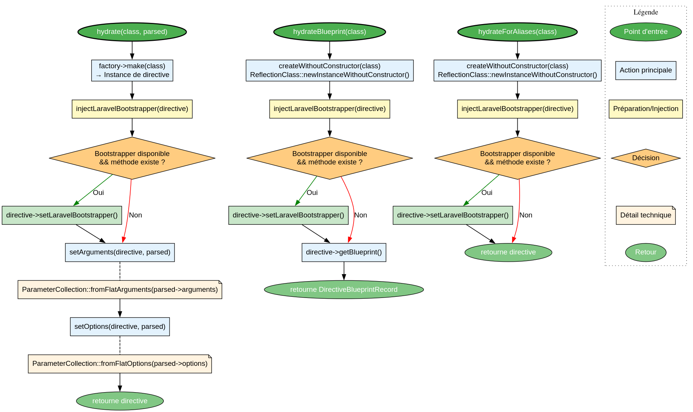

# DirectiveHydratorService - Référence Technique

## Description

Service responsable de l'hydratation des instances de directives avec les données parsées (arguments, options) et l'injection des dépendances (bootstrapper Laravel).

## Hiérarchie

```
DirectiveHydratorService (final)
    └── Dépend de : DirectiveFactoryInterface
    └── Utilise : ParameterCollection, ParsedDirectiveRecord
```

## Rôle principal

Transformer un enregistrement parsé (`ParsedDirectiveRecord`) en une instance de directive entièrement configurée. Gère l'injection du bootstrapper Laravel, la conversion des arguments plats en collections typées, et la création d'instances sans constructeur pour l'extraction des métadonnées.

## Installation

```bash
composer require andydefer/laravel-directive
```

## API / Méthodes publiques

### `hydrate(string $class, ParsedDirectiveRecord $parsed): DirectiveInterface`

Hydrate complètement une directive avec les arguments et options parsés.

| Paramètre | Type | Description |
|-----------|------|-------------|
| `$class` | `string` | FQCN de la directive (ex: `UserListDirective::class`) |
| `$parsed` | `ParsedDirectiveRecord` | Enregistrement contenant les arguments et options parsés |

**Retourne :** `DirectiveInterface` - Instance de directive hydratée

**Exemple :**
```php
$parsed = new ParsedDirectiveRecord($arguments, $options);
$directive = $hydrator->hydrate(UserListDirective::class, $parsed);
$directive->execute();
```

### `hydrateBlueprint(string $class): DirectiveBlueprintRecord`

Extrait le blueprint d'une directive sans exécuter son constructeur.

| Paramètre | Type | Description |
|-----------|------|-------------|
| `$class` | `string` | FQCN de la directive |

**Retourne :** `DirectiveBlueprintRecord` - Blueprint contenant signature et description

**Exemple :**
```php
$blueprint = $hydrator->hydrateBlueprint(UserListDirective::class);
echo $blueprint->signature; // 'user-list'
```

### `hydrateForAliases(string $class): DirectiveInterface`

Extrait une instance de directive pour la résolution d'alias (sans exécuter le constructeur).

| Paramètre | Type | Description |
|-----------|------|-------------|
| `$class` | `string` | FQCN de la directive |

**Retourne :** `DirectiveInterface` - Instance de directive (constructeur non exécuté)

**Exemple :**
```php
$directive = $hydrator->hydrateForAliases(UserListDirective::class);
$aliases = $directive->getAliases(); // ['users', 'list-users']
```

### `setLaravelBootstrapper(?LaravelBootstrapper $bootstrapper): void`

Définit le bootstrapper Laravel pour les directives qui en ont besoin.

| Paramètre | Type | Description |
|-----------|------|-------------|
| `$bootstrapper` | `LaravelBootstrapper|null` | Instance du bootstrapper |

## Cas d'utilisation

### Cas 1 : Hydratation complète d'une directive

```php
// Parser les arguments de la ligne de commande
$parser = new DirectiveParserService();
$parsed = $parser->parse('user-create {name} {email}', $argv);

// Hydrater la directive
$hydrator = new DirectiveHydratorService($factory);
$directive = $hydrator->hydrate(UserCreateDirective::class, $parsed);

// Exécuter
$exitCode = $directive->execute();
```

### Cas 2 : Extraction du blueprint pour l'affichage de l'aide

```php
$blueprint = $hydrator->hydrateBlueprint(UserListDirective::class);
echo $blueprint->signature;     // 'user-list'
echo $blueprint->description;   // 'List all users'
```

### Cas 3 : Extraction des alias pour la résolution

```php
$directive = $hydrator->hydrateForAliases(UserListDirective::class);
$aliases = $directive->getAliases(); // StringTypedCollection

foreach ($aliases as $alias) {
    echo "Alias: {$alias}\n";
}
```

### Cas 4 : Avec bootstrap Laravel

```php
$bootstrapper = new LaravelBootstrapper();
$bootstrapper->bootstrap();

$hydrator = new DirectiveHydratorService($factory);
$hydrator->setLaravelBootstrapper($bootstrapper);

$directive = $hydrator->hydrate(DatabaseDirective::class, $parsed);
// La directive peut maintenant utiliser Eloquent
```

## Flux d'exécution

## Gestion des erreurs

| Situation | Comportement |
|-----------|--------------|
| Classe non trouvée | Exception propagée par `ReflectionClass` |
| Factory ne peut pas créer l'instance | Exception propagée |
| Directive sans méthode `setArguments` | Arguments ignorés (pas d'erreur) |
| Directive sans méthode `setOptions` | Options ignorées (pas d'erreur) |
| Directive sans méthode `setLaravelBootstrapper` | Bootstrapper ignoré (pas d'erreur) |

## Intégration

`DirectiveHydratorService` s'intègre avec :

- **`DirectiveFactoryInterface`** : Création des instances de directives
- **`ParameterCollection`** : Conversion des arguments/options plats en collections typées
- **`ParsedDirectiveRecord`** : Données parsées à hydrater
- **`LaravelBootstrapper`** : Injection optionnelle pour les directives Laravel
- **`DirectiveBlueprintRecord`** : Métadonnées extraites

## Performance

| Aspect | Caractéristique |
|--------|----------------|
| Hydratation complète | O(n) avec n = nombre d'arguments + options |
| Extraction blueprint | O(1) + réflexion |
| Extraction alias | O(1) + réflexion |
| Réflexion | Utilisée uniquement pour `createWithoutConstructor` |

## Compatibilité

| Version | Support |
|---------|---------|
| PHP 8.1+ | ✅ Requis (réflexion, types union) |
| PHP 8.2+ | ✅ Complet |
| PHP 8.3+ | ✅ Complet |

## Exemple complet

```php
<?php

declare(strict_types=1);

use AndyDefer\Directive\Factories\ContainerDirectiveFactory;
use AndyDefer\Directive\Records\ParsedDirectiveRecord;
use AndyDefer\Directive\Services\DirectiveHydratorService;
use AndyDefer\Directive\Services\LaravelBootstrapper;
use AndyDefer\DomainStructures\Collections\Utility\ScalarTypedCollection;
use Illuminate\Container\Container;

// 1. Créer le conteneur et la factory
$container = new Container();
$factory = new ContainerDirectiveFactory($container);

// 2. Créer l'hydrateur
$hydrator = new DirectiveHydratorService($factory);

// 3. (Optionnel) Ajouter le bootstrapper Laravel
$bootstrapper = new LaravelBootstrapper();
$hydrator->setLaravelBootstrapper($bootstrapper);

// 4. Créer un record parsé
$arguments = new ScalarTypedCollection();
$arguments->add('John Doe', 'name', 'john@example.com', 'email');

$options = new ScalarTypedCollection();
$options->add('role', 'admin', 'notify', true);

$parsed = new ParsedDirectiveRecord($arguments, $options);

// 5. Hydrater la directive
$directive = $hydrator->hydrate(UserCreateDirective::class, $parsed);

// 6. Exécuter
$exitCode = $directive->execute();

// 7. Extraire le blueprint
$blueprint = $hydrator->hydrateBlueprint(UserListDirective::class);
echo "Signature: " . $blueprint->signature . "\n";
echo "Description: " . $blueprint->description . "\n";

// 8. Extraire les alias
$aliasDirective = $hydrator->hydrateForAliases(UserListDirective::class);
foreach ($aliasDirective->getAliases() as $alias) {
    echo "Alias: {$alias}\n";
}
```
---