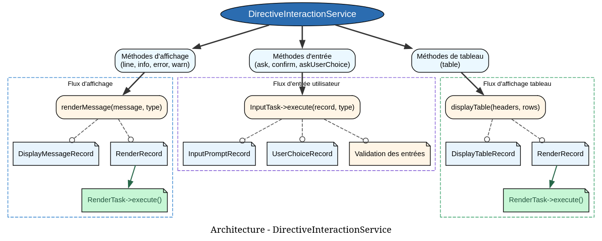

# DirectiveInteractionService - Référence Technique

## Description

Service central pour toutes les interactions utilisateur dans les directives CLI. Gère l'affichage des messages, la capture des entrées utilisateur et le rendu des tableaux.

## Hiérarchie

```
DirectiveInteractionService (final)
    ├── Dépend de : RenderDispatcher
    └── Dépend de : InputDispatcher
```

## Rôle principal

Faire le pont entre les directives et les tâches de rendu/entrée. Fournit une API simple et cohérente pour afficher des messages (info, erreur, avertissement), poser des questions, demander des confirmations et afficher des tableaux formatés.

## Installation

```bash
composer require andydefer/laravel-directive
```

## API / Méthodes publiques

### `line(string $message): void`

Affiche un message texte brut.

| Paramètre | Type | Description |
|-----------|------|-------------|
| `$message` | `string` | Le message à afficher |

**Exemple :**
```php
$this->interaction->line('Processing users...');
```

### `info(string $message): void`

Affiche un message d'information (généralement en vert).

| Paramètre | Type | Description |
|-----------|------|-------------|
| `$message` | `string` | Le message d'information |

**Exemple :**
```php
$this->interaction->info('Operation completed successfully!');
```

### `error(string $message): void`

Affiche un message d'erreur (généralement en rouge).

| Paramètre | Type | Description |
|-----------|------|-------------|
| `$message` | `string` | Le message d'erreur |

**Exemple :**
```php
$this->interaction->error('Failed to connect to database.');
```

### `warn(string $message): void`

Affiche un message d'avertissement (généralement en jaune).

| Paramètre | Type | Description |
|-----------|------|-------------|
| `$message` | `string` | Le message d'avertissement |

**Exemple :**
```php
$this->interaction->warn('This operation may take a while.');
```

### `ask(string $question): string`

Pose une question et retourne la réponse de l'utilisateur.

| Paramètre | Type | Description |
|-----------|------|-------------|
| `$question` | `string` | La question à poser |

**Retourne :** `string` - La réponse saisie (trimée)

**Exemple :**
```php
$name = $this->interaction->ask('What is your name?');
```

### `confirm(string $question): bool`

Demande une confirmation et retourne le choix de l'utilisateur.

| Paramètre | Type | Description |
|-----------|------|-------------|
| `$question` | `string` | La question de confirmation |

**Retourne :** `bool` - `true` pour `y`/`yes`, `false` pour `n`/`no`

**Exemple :**
```php
if ($this->interaction->confirm('Do you want to continue?')) {
    // Continuer
}
```

### `askUserChoice(string $name, int $max): int`

Demande à l'utilisateur de choisir dans une liste numérotée.

| Paramètre | Type | Description |
|-----------|------|-------------|
| `$name` | `string` | Le nom du choix (pour l'affichage) |
| `$max` | `int` | Le nombre maximum de choix (1 à max) |

**Retourne :** `int` - Le numéro choisi (1 à max)

**Exemple :**
```php
$choice = $this->interaction->askUserChoice('Select an option', 5);
// Affiche: "Which one do you want to use? [1-5]: "
```

### `table(StringTypedCollection $headers, RowCollection $rows): void`

Affiche un tableau formaté avec en-têtes et lignes.

| Paramètre | Type | Description |
|-----------|------|-------------|
| `$headers` | `StringTypedCollection` | Les en-têtes du tableau |
| `$rows` | `RowCollection` | Les lignes du tableau |

**Exemple :**
```php
$headers = new StringTypedCollection();
$headers->add('ID', 'Name', 'Email');

$rows = new RowCollection();
$row = new RowCollection();
$row->add(1, 'John Doe', 'john@example.com');
$rows->add($row);

$this->interaction->table($headers, $rows);
```

## Cas d'utilisation

### Cas 1 : Directive interactive complète

```php
final class SetupDirective extends AbstractDirective
{
    public function execute(): ExitCode
    {
        $this->interaction->info('Welcome to the setup wizard!');
        
        $appName = $this->interaction->ask('Application name');
        $environment = $this->interaction->ask('Environment (local/production)');
        
        if (!$this->interaction->confirm("Create configuration for {$appName}?")) {
            $this->interaction->warn('Setup cancelled');
            return ExitCode::SUCCESS;
        }
        
        $headers = new StringTypedCollection();
        $headers->add('Setting', 'Value');
        
        $rows = new RowCollection();
        $row = new RowCollection();
        $row->add('App Name', $appName);
        $row->add('Environment', $environment);
        $rows->add($row);
        
        $this->interaction->table($headers, $rows);
        $this->interaction->info('Setup completed!');
        
        return ExitCode::SUCCESS;
    }
}
```

### Cas 2 : Menu avec choix utilisateur

```php
public function execute(): ExitCode
{
    $this->interaction->info('Available actions:');
    $this->interaction->line('1. List users');
    $this->interaction->line('2. Create user');
    $this->interaction->line('3. Delete user');
    $this->interaction->line('4. Exit');
    
    $choice = $this->interaction->askUserChoice('Select an action', 4);
    
    return match($choice) {
        1 => $this->listUsers(),
        2 => $this->createUser(),
        3 => $this->deleteUser(),
        4 => ExitCode::SUCCESS,
        default => ExitCode::INVALID_ARGUMENT,
    };
}
```

### Cas 3 : Résultats en tableau

```php
public function execute(): ExitCode
{
    $users = $this->userRepository->all();
    
    $headers = new StringTypedCollection();
    $headers->add('ID', 'Name', 'Email', 'Status');
    
    $rows = new RowCollection();
    foreach ($users as $user) {
        $row = new RowCollection();
        $row->add($user->id, $user->name, $user->email, $user->active ? 'Active' : 'Inactive');
        $rows->add($row);
    }
    
    $this->interaction->table($headers, $rows);
    $this->interaction->info('Total: ' . count($users) . ' users');
    
    return ExitCode::SUCCESS;
}
```

## Flux d'exécution

## Gestion des erreurs

| Situation | Comportement |
|-----------|--------------|
| Entrée utilisateur vide pour `ask()` | Retourne une chaîne vide |
| Confirmation avec réponse invalide | `confirm()` retourne `false` |
| Choix utilisateur non numérique | `askUserChoice()` retourne `0` |
| Choix utilisateur hors plage | `askUserChoice()` retourne `0` |

## Intégration

`DirectiveInteractionService` s'intègre avec :

- **`RenderDispatcher`** : Tâche de rendu pour l'affichage
- **`InputDispatcher`** : Tâche d'entrée pour la capture utilisateur
- **`MessageType`** : Enum des types de messages (LINE, INFO, ERROR, WARNING)
- **`InputType`** : Enum des types d'entrée (SIMPLE_QUESTION, CONFIRMATION, USER_CHOICE)
- **`RenderType`** : Enum des types de rendu (DISPLAY_MESSAGE, TABLE)

## Performance

| Aspect | Caractéristique |
|--------|----------------|
| Affichage | Délégation à RenderDispatcher (pas de surcharge) |
| Entrée | Délégation à InputDispatcher (temps réel utilisateur) |
| Tableau | O(n × m) avec n = lignes, m = colonnes |

## Compatibilité

| Version | Support |
|---------|---------|
| PHP 8.1+ | ✅ Requis |
| PHP 8.2+ | ✅ Complet |
| PHP 8.3+ | ✅ Complet |

## Exemple complet

```php
<?php

declare(strict_types=1);

use AndyDefer\Directive\Services\DirectiveInteractionService;
use AndyDefer\Directive\Dispatchers\InputDispatcher;
use AndyDefer\Directive\Dispatchers\RenderDispatcher;

// 1. Créer les dépendances
$renderDispatcher = new RenderDispatcher();
$inputDispatcher = new InputDispatcher();

// 2. Créer le service d'interaction
$interaction = new DirectiveInteractionService($renderDispatcher, $inputDispatcher);

// 3. Afficher un message de bienvenue
$interaction->info('Welcome to the application!');

// 4. Poser une question
$name = $interaction->ask('What is your name?');
$interaction->line("Hello, {$name}!");

// 5. Demander une confirmation
if ($interaction->confirm('Do you want to see the list?')) {
    // 6. Afficher un tableau
    $headers = new StringTypedCollection();
    $headers->add('Item', 'Value');
    
    $rows = new RowCollection();
    $row = new RowCollection();
    $row->add('Name', $name);
    $row->add('Time', date('Y-m-d H:i:s'));
    $rows->add($row);
    
    $interaction->table($headers, $rows);
}

// 7. Menu de choix
$choice = $interaction->askUserChoice('Select an option', 3);
$interaction->info("You selected option {$choice}");

// 8. Message de fin
$interaction->info('Goodbye!');
```

## Voir aussi

- [`RenderDispatcher`](../tasks/render-task.md) - Tâche de rendu
- [`InputDispatcher`](../tasks/input-task.md) - Tâche d'entrée utilisateur
- [`MessageType`](../enums/message-type.md) - Types de messages
- [`InputType`](../enums/input-type.md) - Types d'entrée
- [`RowCollection`](../collections/row-collection.md) - Collection pour lignes de tableau