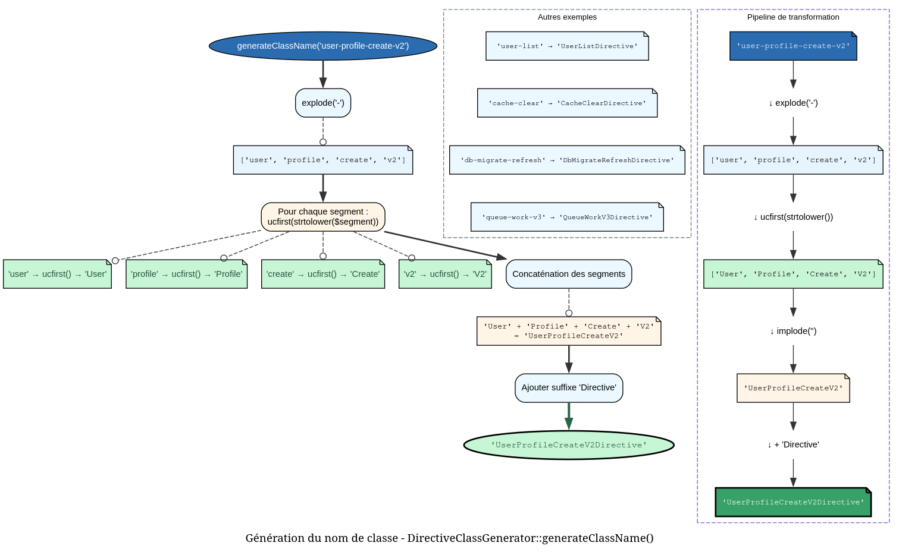

```markdown
# DirectiveNamingService - Référence Technique

## Description

Service de génération de noms de classes et de signatures pour les directives, avec conversion automatique entre différentes conventions de nommage (kebab-case, PascalCase) et substitution de variables dans les stubs.

## Hiérarchie

```
Aucune hiérarchie - Classe finale sans extension ni implémentation
```

## Rôle principal

Ce service assure la conversion cohérente entre les noms de directives (format kebab-case utilisateur) et les noms de classes PHP (format PascalCase avec suffixe `Directive`). Il fournit également des utilitaires pour générer des signatures avec options et pour remplacer des variables dans des templates de stubs lors de la génération automatique de code.

## Installation

```bash
composer require andydefer/php-records
```

Aucune configuration supplémentaire requise.

```php
$naming = new DirectiveNamingService();
$className = $naming->generateClassName('user-create'); // 'UserCreateDirective'
```

## API / Méthodes publiques

### `generateClassName(string $name): string`

| Paramètre | Type | Description |
|-----------|------|-------------|
| `$name` | `string` | Nom de la directive au format kebab-case (ex: 'user-create') |

**Retourne :** `string` - Nom de classe au format PascalCase avec suffixe 'Directive'

**Exemples :**
```php
$naming = new DirectiveNamingService();

$naming->generateClassName('user-create');     // 'UserCreateDirective'
$naming->generateClassName('clean-log');       // 'CleanLogDirective'
$naming->generateClassName('db-migrate-fresh'); // 'DbMigrateFreshDirective'
$naming->generateClassName('api-v2');          // 'ApiV2Directive'
```

### `generateSignatureWithOption(string $name): string`

| Paramètre | Type | Description |
|-----------|------|-------------|
| `$name` | `string` | Nom de base de la directive |

**Retourne :** `string` - Signature complète avec placeholder d'option `{--option}`

**Exemple :**
```php
$signature = $naming->generateSignatureWithOption('user-create');
// 'user-create {--option}'
```

### `replaceStubVariables(string $stub, string $className, string $signature): string`

| Paramètre | Type | Description |
|-----------|------|-------------|
| `$stub` | `string` | Contenu du template avec placeholders |
| `$className` | `string` | Nom de la classe de la directive |
| `$signature` | `string` | Signature de base de la directive |

**Retourne :** `string` - Contenu du template avec les placeholders remplacés

**Placeholders disponibles :**
| Placeholder | Description | Exemple |
|-------------|-------------|---------|
| `{{class}}` | Nom de la classe | `UserCreateDirective` |
| `{{signature}}` | Signature avec option | `user-create {--option}` |
| `{{description}}` | Description par défaut | `Generated directive for user-create` |
| `{{date}}` | Date et heure actuelles | `2024-01-15 14:30:00` |

**Exemple :**
```php
$stub = 'class {{class}} extends BaseDirective {
    protected string $signature = "{{signature}}";
    protected string $description = "{{description}}";
}';

$result = $naming->replaceStubVariables(
    $stub,
    'UserCreateDirective',
    'user-create'
);
```

### `extractBaseName(string $className): string`

| Paramètre | Type | Description |
|-----------|------|-------------|
| `$className` | `string` | Nom de la classe de directive (ex: 'UserCreateDirective') |

**Retourne :** `string` - Nom de base au format kebab-case

**Exemples :**
```php
$naming->extractBaseName('UserCreateDirective');     // 'user-create'
$naming->extractBaseName('ApiV2Directive');          // 'api-v2'
$naming->extractBaseName('UserProfileCreateV2Directive'); // 'user-profile-create-v2'
```

## Cas d'utilisation

### Cas 1 : Génération automatique de directives

**Problème :** Créer une commande qui génère automatiquement une classe de directive à partir d'un nom utilisateur.

```php
class GenerateDirectiveCommand
{
    private DirectiveNamingService $naming;
    private FileSystem $fs;
    
    public function execute(string $directiveName): void
    {
        // Générer le nom de classe
        $className = $this->naming->generateClassName($directiveName);
        
        // Générer la signature
        $signature = $this->naming->generateSignatureWithOption($directiveName);
        
        // Charger le stub
        $stub = $this->fs->read(__DIR__ . '/stubs/directive.stub');
        
        // Remplacer les variables
        $content = $this->naming->replaceStubVariables($stub, $className, $directiveName);
        
        // Écrire le fichier
        $this->fs->write("app/Directives/{$className}.php", $content);
        
        echo "✅ Directive {$className} created successfully\n";
    }
}
```

### Cas 2 : Reverse engineering de directives existantes

**Problème :** Analyser des classes existantes pour extraire leur nom de commande.

```php
class DirectiveAnalyzer
{
    private DirectiveNamingService $naming;
    
    public function analyze(string $className): array
    {
        $baseName = $this->naming->extractBaseName($className);
        
        return [
            'class' => $className,
            'command' => $baseName,
            'signature' => $this->naming->generateSignatureWithOption($baseName),
        ];
    }
}

// Utilisation
$analyzer = new DirectiveAnalyzer($naming);
$info = $analyzer->analyze('UserCreateDirective');
// $info = [
//     'class' => 'UserCreateDirective',
//     'command' => 'user-create',
//     'signature' => 'user-create {--option}'
// ]
```

### Cas 3 : Validation et normalisation des noms

**Problème :** Normaliser les noms de directives saisis par les utilisateurs.

```php
class DirectiveNormalizer
{
    private DirectiveNamingService $naming;
    
    public function normalize(string $input): string
    {
        // Convertir différents formats en kebab-case standard
        $kebabCase = str_replace('_', '-', $input);
        $kebabCase = strtolower(preg_replace('/(?<!^)(?=[A-Z])/', '-', $kebabCase));
        
        // Vérifier que le nom normalisé peut être converti en classe
        $className = $this->naming->generateClassName($kebabCase);
        
        return $kebabCase;
    }
}
```

### Cas 4 : Génération de documentation

**Problème :** Générer automatiquement la documentation des directives.

```php
class DocumentationGenerator
{
    private DirectiveNamingService $naming;
    
    public function generateMarkdown(array $directives): string
    {
        $markdown = "# Available Directives\n\n";
        
        foreach ($directives as $directive) {
            $className = $directive['class'];
            $command = $this->naming->extractBaseName($className);
            
            $markdown .= sprintf(
                "## %s\n\n- **Command:** `%s`\n- **Class:** `%s`\n\n",
                ucfirst(str_replace('-', ' ', $command)),
                $command,
                $className
            );
        }
        
        return $markdown;
    }
}
```

### Cas 5 : Migration entre versions

**Problème :** Migrer d'une ancienne convention de nommage vers la nouvelle.

```php
class DirectiveMigrator
{
    private DirectiveNamingService $naming;
    
    public function migrateClassName(string $oldClassName): string
    {
        // Extraire le nom de base de l'ancienne convention
        // Ancienne convention: user_create_directive
        $baseName = str_replace('_directive', '', strtolower($oldClassName));
        $baseName = str_replace('_', '-', $baseName);
        
        // Générer le nouveau nom selon la convention
        return $this->naming->generateClassName($baseName);
    }
}

// 'user_create_directive' -> 'UserCreateDirective'
```

## Flux d'exécution

### Conversion kebab-case → PascalCase



### Conversion PascalCase → kebab-case

```
extractBaseName('UserProfileCreateV2Directive')
    ↓
Supprimer suffixe 'Directive' → 'UserProfileCreateV2'
    ↓
PregSplit sur les majuscules → ['User', 'Profile', 'Create', 'V2']
    ↓
Implode avec '-' → 'User-Profile-Create-V2'
    ↓
strtolower() → 'user-profile-create-v2'
```

## Gestion des erreurs

Aucune exception n'est levée directement par ce service. Cependant, les comportements limites sont gérés :

| Situation | Comportement | Exemple |
|-----------|--------------|---------|
| Nom vide | Génère une classe `Directive` (seulement suffixe) | `''` → `'Directive'` |
| Nom avec tirets consécutifs | Crée des segments vides | `'user--create'` → `'UserCreateDirective'` (segment vide ignoré) |
| Nom avec chiffres | Les chiffres sont préservés | `'v2-api'` → `'V2ApiDirective'` |
| Classe sans suffixe | Extrait quand même le nom de base | `'UserCreate'` → `'user-create'` |

## Intégration

### Avec un générateur de code

```php
class DirectiveGenerator
{
    public function __construct(
        private DirectiveNamingService $naming,
        private string $stubPath,
    ) {}
    
    public function generate(string $name): void
    {
        $className = $this->naming->generateClassName($name);
        $stub = file_get_contents($this->stubPath);
        $content = $this->naming->replaceStubVariables($stub, $className, $name);
        
        file_put_contents("src/Directives/{$className}.php", $content);
    }
}
```

### Avec un système de plugins

```php
class PluginLoader
{
    private DirectiveNamingService $naming;
    
    public function loadPlugin(string $pluginClass): void
    {
        // Extraire le nom de commande depuis la classe
        $commandName = $this->naming->extractBaseName($pluginClass);
        
        // Enregistrer la directive
        $this->register($commandName, $pluginClass);
    }
}
```

### Pattern Builder pour les signatures

```php
$signature = $naming->generateSignatureWithOption($name);
// Peut être combiné avec d'autres services
$fullSignature = $signature . ' {--force}';
```

## Performance

- **Complexité temporelle :** O(n) où n est le nombre de segments dans le nom
- **Opérations :**
  - `explode()` : O(n)
  - `ucfirst()` : O(m) par segment (m = longueur du segment)
  - `preg_split()` : O(n) pour l'extraction
- **Mémoire :** Stocke le tableau de segments temporairement
- **Optimisation :** Les opérations sont légères et adaptées à une utilisation fréquente

### Benchmarks indicatifs

| Opération | Taille moyenne | Temps moyen |
|-----------|---------------|-------------|
| generateClassName | 2-4 segments | ~0.3 µs |
| extractBaseName | 2-4 segments | ~0.5 µs |
| replaceStubVariables | 4 placeholders | ~1.0 µs |

## Compatibilité

| Version PHP | Support |
|-------------|---------|
| PHP 8.1+ | ✅ Complet |
| PHP 8.0 | ✅ Complet |

## Exemple complet

```php
<?php

declare(strict_types=1);

use AndyDefer\Directive\Services\DirectiveNamingService;

$naming = new DirectiveNamingService();

// ==================== Conversion des noms ====================

echo "=== Name Conversion ===\n\n";

$directiveNames = [
    'user-create',
    'cache-clear',
    'db-migrate-fresh',
    'api-v2',
    'generate-report-daily',
];

foreach ($directiveNames as $name) {
    $className = $naming->generateClassName($name);
    $extracted = $naming->extractBaseName($className);
    
    echo sprintf(
        "%-25s → %-30s → %-20s %s\n",
        $name,
        $className,
        $extracted,
        $extracted === $name ? '✅' : '❌'
    );
}

// ==================== Génération de signatures ====================

echo "\n=== Signature Generation ===\n\n";

foreach ($directiveNames as $name) {
    $signature = $naming->generateSignatureWithOption($name);
    echo "{$name} → {$signature}\n";
}

// ==================== Template de stub ====================

echo "\n=== Stub Generation ===\n\n";

$stubTemplate = '<?php

declare(strict_types=1);

namespace App\Directives;

use AndyDefer\Directive\Attributes\AsDirective;
use AndyDefer\Directive\Contracts\DirectiveInterface;

#[AsDirective(name: "{{signature}}")]
class {{class}} implements DirectiveInterface
{
    /**
     * {{description}}
     *
     * @generated {{date}}
     */
    public function __invoke(array $parameters = []): void
    {
        // TODO: Implement directive logic
    }
}';

// Générer une directive
$className = $naming->generateClassName('send-welcome-email');
$content = $naming->replaceStubVariables(
    $stubTemplate,
    $className,
    'send-welcome-email'
);

echo $content;

// ==================== Validation des conversions ====================

echo "\n=== Round-trip Validation ===\n\n";

$testCases = [
    'simple-name',
    'multiple-hyphens-name',
    'with-numbers-v2',
    'complex-name-with-multiple-parts',
];

$allPassed = true;

foreach ($testCases as $original) {
    $className = $naming->generateClassName($original);
    $extracted = $naming->extractBaseName($className);
    $passed = $original === $extracted;
    $allPassed = $allPassed && $passed;
    
    echo sprintf(
        "%-40s → %-35s → %-40s %s\n",
        $original,
        $className,
        $extracted,
        $passed ? '✅' : '❌'
    );
}

echo "\n" . ($allPassed ? "✅ All tests passed!" : "❌ Some tests failed") . "\n";

// ==================== Utilisation pratique ====================

echo "\n=== Practical Usage ===\n\n";

class DirectiveScanner
{
    private DirectiveNamingService $naming;
    
    public function __construct(DirectiveNamingService $naming)
    {
        $this->naming = $naming;
    }
    
    public function scan(string $directory): array
    {
        $directives = [];
        $files = glob($directory . '/*Directive.php');
        
        foreach ($files as $file) {
            $className = basename($file, '.php');
            $command = $this->naming->extractBaseName($className);
            
            $directives[] = [
                'class' => $className,
                'command' => $command,
                'file' => $file,
                'signature' => $this->naming->generateSignatureWithOption($command),
            ];
        }
        
        return $directives;
    }
}

$scanner = new DirectiveScanner($naming);
$directives = $scanner->scan(__DIR__ . '/../src/Directives');

echo sprintf("Found %d directives:\n", count($directives));
foreach ($directives as $directive) {
    echo sprintf("  - %s (%s)\n", $directive['command'], $directive['class']);
}
```
---