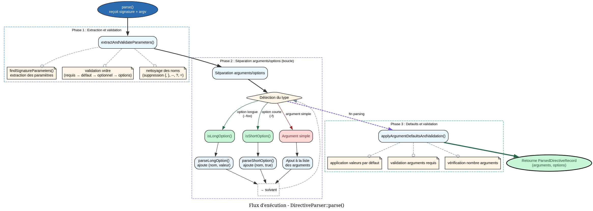

# DirectiveParserService - Référence Technique

## Description

Analyse les signatures de commandes console et extrait les arguments et options en respectant un ordre strict de paramètres.

## Hiérarchie

```
Aucune hiérarchie - Classe finale sans extension ni implémentation
```

## Rôle principal

Convertit une signature textuelle (ex: `user:create {name} {email} {--role=}`) et les arguments bruts en une structure typée séparant les arguments positionnels des options. Garantit la validité de l'ordre des paramètres selon les règles : requis → valeur par défaut → optionnel → options.

## Installation

```bash
composer require andydefer/php-records
```

Aucune configuration supplémentaire requise. Le service utilise une configuration par défaut via `DirectiveParserConfig`.

## API / Méthodes publiques

### `parse(string $signature, StringTypedCollection $argv): ParsedDirectiveRecord`

| Paramètre | Type | Description |
|-----------|------|-------------|
| `$signature` | `string` | Signature de la directive contenant les paramètres entre accolades |
| `$argv` | `StringTypedCollection<string>` | Arguments bruts passés à la directive |

**Retourne :** `ParsedDirectiveRecord` - Directive parsée contenant arguments et options séparés

**Exceptions :** `InvalidArgumentException` - Format de signature invalide ou nombre d'arguments incorrect

**Exemple :**
```php
$argv = new StringTypedCollection();
$argv->add('John', '--role=admin');

$result = $service->parse('user:create {name} {--role=}', $argv);
// $result->arguments contient 'John'
// $result->options contient 'role' => 'admin'
```

### `extractHelp(string $signature): ParsedParameterCollection`

| Paramètre | Type | Description |
|-----------|------|-------------|
| `$signature` | `string` | Signature de la directive contenant les paramètres entre accolades |

**Retourne :** `ParsedParameterCollection<ParsedParameterRecord>` - Collection de paramètres parsés pour l'affichage d'aide

**Exemple :**
```php
$help = $service->extractHelp('user:create {name} {--role=admin}');
// Collection contenant un argument 'name' requis
// Et une option 'role' avec valeur par défaut 'admin'
```

### `toResult(ParsedDirectiveRecord $parsed): ParsedResultRecord`

| Paramètre | Type | Description |
|-----------|------|-------------|
| `$parsed` | `ParsedDirectiveRecord` | Directive parsée à convertir |

**Retourne :** `ParsedResultRecord` - Enregistrement résultat avec collections `ParameterCollection`

**Exemple :**
```php
$parsed = $service->parse('test:cmd', $argv);
$result = $service->toResult($parsed);
// $result->arguments est une ParameterCollection
// $result->options est une ParameterCollection
```

### `toJson(ParsedDirectiveRecord $parsed): string`

| Paramètre | Type | Description |
|-----------|------|-------------|
| `$parsed` | `ParsedDirectiveRecord` | Directive parsée à convertir |

**Retourne :** `string` - Représentation JSON de la directive parsée

**Exemple :**
```php
$json = $service->toJson($parsed);
// Retourne: {"arguments":{"name":"John"},"options":{"role":"admin"}}
```

## Cas d'utilisation

### Cas 1 : Commande utilisateur avec arguments obligatoires

**Problème :** Une commande `user:create` nécessite toujours un nom et un email.

```php
$argv = new StringTypedCollection();
$argv->add('Jane Doe', 'jane@example.com');

$result = $service->parse('user:create {name} {email}', $argv);
$parsed = $service->toResult($result);

echo $parsed->arguments->get('name');  // "Jane Doe"
echo $parsed->arguments->get('email'); // "jane@example.com"
```

### Cas 2 : Options avec valeurs par défaut

**Problème :** Une commande `cache:clear` accepte un niveau optionnel, par défaut "all".

```php
$argv = new StringTypedCollection();
// Aucun argument fourni

$result = $service->parse('cache:clear {level=all}', $argv);
$parsed = $service->toResult($result);

echo $parsed->arguments->get('level'); // "all" (valeur par défaut)
```

### Cas 3 : Mélange d'arguments et d'options

**Problème :** Une commande `user:update` reçoit l'ID, puis des options comme `--role` et `--active`.

```php
$argv = new StringTypedCollection();
$argv->add('123', '--role=editor', '--active');

$result = $service->parse('user:update {id} {--role=} {--active}', $argv);
$parsed = $service->toResult($result);

echo $parsed->arguments->get('id');     // "123"
echo $parsed->options->get('role');     // "editor"
echo $parsed->options->get('active');   // true
```

### Cas 4 : Extraction d'aide pour documentation

**Problème :** Générer automatiquement l'aide d'une commande.

```php
$parameters = $service->extractHelp('user:create {name} {email} {--role=admin}');

foreach ($parameters as $param) {
    if ($param->type === ParameterType::ARGUMENT) {
        echo $param->name . ($param->required ? ' (required)' : ' (optional)');
    } else {
        echo "--{$param->name}" . ($param->default ? "={$param->default}" : '');
    }
}
```

### Cas 5 : Options booléennes (flags)

**Problème :** Une commande `deploy` accepte un flag `--force` sans valeur.

```php
$argv = new StringTypedCollection();
$argv->add('--force');

$result = $service->parse('deploy {--force}', $argv);
$parsed = $service->toResult($result);

if ($parsed->options->get('force') === true) {
    echo "Force mode enabled";
}
```

## Flux d'exécution



## Gestion des erreurs

| Situation | Exception | Message |
|-----------|-----------|---------|
| Argument requis après argument avec défaut | `InvalidArgumentException` | `Invalid signature format: Required arguments must come before arguments with default values, optional arguments, and options. Problem with: {{$param}}` |
| Argument avec défaut après option | `InvalidArgumentException` | `Invalid signature format: Arguments with default values must come before optional arguments and options. Problem with: {{$param}}` |
| Argument optionnel après option | `InvalidArgumentException` | `Invalid signature format: Optional arguments must come before options. Problem with: {{$param}}` |
| Argument requis manquant | `InvalidArgumentException` | `Not enough arguments (missing: "{$name}")` |
| Trop d'arguments fournis | `InvalidArgumentException` | `Too many arguments provided` |

## Intégration

### Avec `DirectiveParserConfig`

```php
$config = new DirectiveParserConfig(
    longOptionPrefix: '--',
    shortOptionPrefix: '-',
    optionValueSeparator: '=',
    optionalMarker: '?',
    trueValue: 'true',
    falseValue: 'false',
    emptyOptionAsTrue: true,
);

$service = new DirectiveParserService($config);
```

### Avec `ParsedResultRecord`

```php
$result = $service->toResult($parsed);

// Accès aux arguments par nom
$name = $result->arguments->get('name');

// Accès aux options par nom
$force = $result->options->get('force');

// Itération sur les paramètres
foreach ($result->arguments as $argument) {
    echo $argument->name . ': ' . $argument->value;
}
```

### Avec `ParsedParameterCollection` (aide)

```php
$help = $service->extractHelp('user:create {name} {--role=admin}');

foreach ($help as $param) {
    match ($param->type) {
        ParameterType::ARGUMENT => echo "Argument: {$param->name}",
        ParameterType::OPTION => echo "Option: --{$param->name}",
    };
    
    if ($param->default !== null) {
        echo " (default: {$param->default})";
    }
    
    if (!$param->required) {
        echo " (optional)";
    }
}
```

## Performance

- **Complexité temporelle :** O(n) où n est le nombre d'arguments
- **Allocations mémoire :** Crée plusieurs collections intermédiaires (`StringTypedCollection`, `ScalarTypedCollection`, `ParameterCollection`)
- **Optimisations :**
  - Les expressions régulières sont exécutées une fois par paramètre
  - Aucune boucle imbriquée
  - Les transformations sont applicatives (pas d'effets de bord)
- **Recommandation :** Pour un parsing intensif (milliers de commandes), mettre en cache le résultat de `extractAndValidateParameters()` par signature

## Compatibilité

| Version PHP | Support |
|-------------|---------|
| PHP 8.2+ | ✅ Complet (types union `bool\|string`, `readonly` properties) |
| PHP 8.1 | ✅ Complet (énumérations, types union) |
| PHP 8.0 | ⚠️ Limité (nécessite adaptation des types union) |

## Exemple complet

```php
<?php

declare(strict_types=1);

use AndyDefer\Directive\Services\DirectiveParserService;
use AndyDefer\Directive\Config\DirectiveParserConfig;
use AndyDefer\DomainStructures\Collections\Utility\StringTypedCollection;

// Configuration personnalisée
$config = new DirectiveParserConfig(
    longOptionPrefix: '--',
    shortOptionPrefix: '-',
    optionValueSeparator: '=',
    optionalMarker: '?',
    trueValue: '1',
    falseValue: '0',
    emptyOptionAsTrue: false,
);

$service = new DirectiveParserService($config);

// Signature de commande
$signature = 'user:update {id} {name?} {--role=user} {--active}';

// Arguments réels
$argv = new StringTypedCollection();
$argv->add('42');           // id
$argv->add('Jane Doe');     // name (optionnel)
$argv->add('--role=admin'); // option role
$argv->add('--active');     // flag active

// Parsing
$parsed = $service->parse($signature, $argv);
$result = $service->toResult($parsed);

// Utilisation
echo "User ID: " . $result->arguments->get('id') . "\n";
echo "Name: " . ($result->arguments->get('name') ?? 'not provided') . "\n";
echo "Role: " . $result->options->get('role') . "\n";
echo "Active: " . ($result->options->get('active') ? 'yes' : 'no') . "\n";

// Sortie JSON pour API
$json = $service->toJson($parsed);
file_put_contents('command_result.json', $json);

// Génération d'aide
$help = $service->extractHelp($signature);
echo "\nUsage:\n";
foreach ($help as $param) {
    if ($param->type === ParameterType::ARGUMENT) {
        $marker = $param->required ? '<required>' : '[optional]';
        echo "  {$param->name} {$marker}";
        if ($param->default) echo " (default: {$param->default})";
        echo "\n";
    } else {
        $default = $param->default ? "={$param->default}" : '';
        echo "  --{$param->name}{$default} [flag]\n";
    }
}
```
---