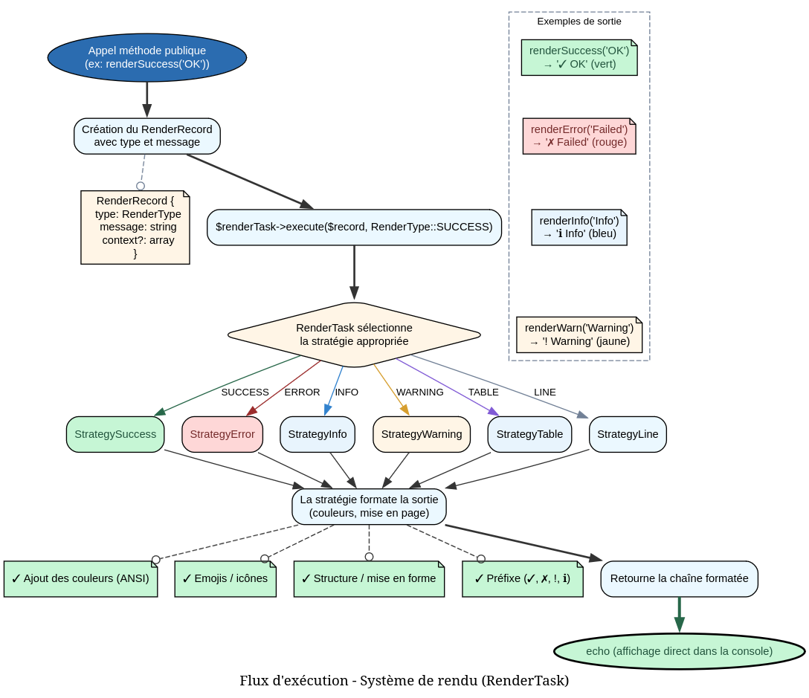

# DirectiveRendererService - Référence Technique

## Description

Service façade pour le rendu des différentes sorties de directives (aide, listes, messages, tableaux).

## Hiérarchie

```
Aucune hiérarchie - Classe finale sans extension ni implémentation
```

## Rôle principal

Agit comme une façade (facade pattern) devant `RenderTask`. Fournit des méthodes dédiées et nommées pour chaque type de rendu, gère le rendu conditionnel (ex: messages de debug uniquement en mode développement) et délègue le travail d'affichage réel à `RenderTask`.

## Installation

```bash
composer require andydefer/php-records
```

Le service nécessite une instance de `RenderTask` injectée dans le constructeur.

```php
$renderTask = new RenderTask($rendererStrategy);
$service = new DirectiveRendererService($renderTask);
```

## API / Méthodes publiques

### `renderHelp(): void`

Affiche l'écran d'aide avec les instructions d'utilisation.

**Exemple :**
```php
$service->renderHelp();
// Affiche la page d'aide complète
```

### `renderList(DirectiveMetadataCollection $directives): void`

| Paramètre | Type | Description |
|-----------|------|-------------|
| `$directives` | `DirectiveMetadataCollection` | Collection des métadonnées des directives à afficher |

Affiche une liste des directives disponibles.

**Exemple :**
```php
$directives = new DirectiveMetadataCollection();
$directives->add(new DirectiveMetadataRecord(name: 'user:create', description: 'Create a user'));
$directives->add(new DirectiveMetadataRecord(name: 'cache:clear', description: 'Clear cache'));

$service->renderList($directives);
```

### `renderNotFound(string $signature): void`

| Paramètre | Type | Description |
|-----------|------|-------------|
| `$signature` | `string` | Signature de la directive non trouvée |

Affiche un message d'erreur indiquant qu'une directive n'existe pas.

**Exemple :**
```php
$service->renderNotFound('unknown:command');
// Affiche: "Directive 'unknown:command' not found"
```

### `renderSuccess(string $message): void`

| Paramètre | Type | Description |
|-----------|------|-------------|
| `$message` | `string` | Message de succès à afficher |

Affiche un message de succès (généralement en vert).

**Exemple :**
```php
$service->renderSuccess('User created successfully');
```

### `renderError(string $message): void`

| Paramètre | Type | Description |
|-----------|------|-------------|
| `$message` | `string` | Message d'erreur à afficher |

Affiche un message d'erreur (généralement en rouge).

**Exemple :**
```php
$service->renderError('Failed to connect to database');
```

### `renderWarning(string $message): void`

| Paramètre | Type | Description |
|-----------|------|-------------|
| `$message` | `string` | Message d'avertissement à afficher |

Affiche un message d'avertissement (généralement en jaune).

**Exemple :**
```php
$service->renderWarning('Deprecated feature used');
```

### `renderDebug(string $message): void`

| Paramètre | Type | Description |
|-----------|------|-------------|
| `$message` | `string` | Message de debug à afficher |

Affiche un message de debug **uniquement si** `DIRECTIVE_DEBUG=true` ou `APP_DEBUG=true` dans l'environnement.

⚠️ **Important :** Seule la valeur exacte `'true'` active le debug. Les valeurs `'1'`, `'yes'`, `'on'` ne sont pas reconnues.

**Exemple :**
```php
// En mode debug activé
putenv('DIRECTIVE_DEBUG=true');
$service->renderDebug('User ID: 42'); // Affiche le message

// En mode debug désactivé
putenv('DIRECTIVE_DEBUG=false');
$service->renderDebug('User ID: 42'); // N'affiche rien
```

### `renderVersion(): void`

Affiche la version du package.

**Exemple :**
```php
$service->renderVersion();
// Affiche: "php-records v1.0.0"
```

### `renderConflict(ConflictDisplayRecord $record): void`

| Paramètre | Type | Description |
|-----------|------|-------------|
| `$record` | `ConflictDisplayRecord` | Enregistrement contenant les données du conflit |

Affiche les conflits de nommage entre directives.

**Exemple :**
```php
$conflict = new ConflictDisplayRecord(
    name: 'create',
    classNames: new StringTypedCollection('UserCreator', 'PostCreator'),
    signatures: new StringTypedCollection('user:create', 'post:create'),
    descriptions: new StringTypedCollection('Create user', 'Create post'),
);

$service->renderConflict($conflict);
```

### `renderTable(DisplayTableRecord $record): void`

| Paramètre | Type | Description |
|-----------|------|-------------|
| `$record` | `DisplayTableRecord` | Enregistrement contenant les données du tableau |

Affiche un tableau formaté dans la console.

**Exemple :**
```php
$headers = new StringTypedCollection('Name', 'Email', 'Role');
$rows = new RowCollection();

$row1 = new RowCollection();
$row1->add('John Doe', 'john@example.com', 'Admin');
$rows->add($row1);

$row2 = new RowCollection();
$row2->add('Jane Smith', 'jane@example.com', 'User');
$rows->add($row2);

$table = new DisplayTableRecord(headers: $headers, rows: $rows);
$service->renderTable($table);
```

### `renderValidationError(ValidationResultRecord $record): void`

| Paramètre | Type | Description |
|-----------|------|-------------|
| `$record` | `ValidationResultRecord` | Enregistrement contenant l'erreur de validation |

Affiche une erreur de validation de signature.

**Exemple :**
```php
$validationError = new ValidationResultRecord(
    isValid: false,
    error: 'Invalid signature format: Required arguments must come before optional arguments',
);

$service->renderValidationError($validationError);
```

## Cas d'utilisation

### Cas 1 : Application console basique

**Problème :** Afficher un message de succès après exécution d'une commande.

```php
class CreateUserCommand
{
    public function __construct(
        private DirectiveRendererService $renderer,
        private UserRepository $repository,
    ) {}
    
    public function execute(string $name, string $email): void
    {
        try {
            $this->repository->create($name, $email);
            $this->renderer->renderSuccess("User {$name} created");
        } catch (Exception $e) {
            $this->renderer->renderError($e->getMessage());
        }
    }
}
```

### Cas 2 : Application avec affichage de liste

**Problème :** Lister toutes les commandes disponibles avec leurs descriptions.

```php
class ListDirectivesCommand
{
    public function __construct(
        private DirectiveRendererService $renderer,
        private DirectiveRegistry $registry,
    ) {}
    
    public function execute(): void
    {
        $directives = $this->registry->getAll();
        
        if ($directives->isEmpty()) {
            $this->renderer->renderWarning('No directives registered');
            return;
        }
        
        $this->renderer->renderList($directives);
    }
}
```

### Cas 3 : Débogage conditionnel

**Problème :** Ajouter des logs de debug qui ne s'affichent qu'en environnement de développement.

```php
class CacheService
{
    public function __construct(
        private DirectiveRendererService $renderer,
    ) {}
    
    public function clear(): void
    {
        $this->renderer->renderDebug('Starting cache clear operation');
        
        // Opération longue
        sleep(2);
        
        $this->renderer->renderDebug('Cache cleared successfully');
        $this->renderer->renderSuccess('Cache cleared');
    }
}
```

### Cas 4 : Génération de rapport tabulaire

**Problème :** Afficher une liste d'utilisateurs formatée en tableau.

```php
class ListUsersCommand
{
    public function __construct(
        private DirectiveRendererService $renderer,
        private UserRepository $repository,
    ) {}
    
    public function execute(): void
    {
        $users = $this->repository->findAll();
        
        $headers = new StringTypedCollection('ID', 'Name', 'Email', 'Status');
        $rows = new RowCollection();
        
        foreach ($users as $user) {
            $row = new RowCollection();
            $row->add($user->id, $user->name, $user->email, $user->isActive() ? 'Active' : 'Inactive');
            $rows->add($row);
        }
        
        $table = new DisplayTableRecord(headers: $headers, rows: $rows);
        $this->renderer->renderTable($table);
    }
}
```

### Cas 5 : Validation et messages d'erreur contextuels

**Problème :** Valider une signature et afficher les erreurs spécifiques.

```php
class SignatureValidator
{
    public function __construct(
        private DirectiveRendererService $renderer,
    ) {}
    
    public function validate(string $signature): bool
    {
        $result = $this->performValidation($signature);
        
        if (!$result->isValid) {
            $this->renderer->renderValidationError($result);
            return false;
        }
        
        $this->renderer->renderSuccess('Signature is valid');
        return true;
    }
    
    private function performValidation(string $signature): ValidationResultRecord
    {
        // Logique de validation...
        if (str_contains($signature, '{')) {
            return new ValidationResultRecord(false, 'Invalid braces in signature');
        }
        
        return new ValidationResultRecord(true, '');
    }
}
```

## Flux d'exécution


## Gestion des erreurs

Aucune exception n'est levée directement par ce service. Les erreurs sont gérées en interne par `RenderTask` et ses stratégies.

| Situation | Comportement |
|-----------|--------------|
| `RenderTask::execute()` échoue | L'exception remonte jusqu'à l'appelant |
| Debug désactivé | `renderDebug()` ne fait rien (retour silencieux) |
| Collection vide pour `renderList()` | Affiche "No directives available" ou message similaire |
| Tableau sans données | Affiche "No data to display" |

## Intégration

### Avec RenderTask

```php
// RenderTask attend une stratégie de rendu
$renderStrategy = new ConsoleRenderStrategy(); // Implémente RenderStrategyInterface
$renderTask = new RenderTask($renderStrategy);

$renderer = new DirectiveRendererService($renderTask);
```

### Avec d'autres services

```php
class DirectiveApplication
{
    public function __construct(
        private DirectiveParserService $parser,
        private DirectiveRendererService $renderer,
        private DirectiveExecutor $executor,
    ) {}
    
    public function run(string $signature, array $argv): void
    {
        try {
            $parsed = $this->parser->parse($signature, $argv);
            $result = $this->executor->execute($parsed);
            
            $this->renderer->renderSuccess($result->message);
        } catch (InvalidArgumentException $e) {
            $this->renderer->renderError($e->getMessage());
            $this->renderer->renderHelp();
        }
    }
}
```

### Configuration des variables d'environnement

```bash
# Activer le debug (une des deux suffit)
export DIRECTIVE_DEBUG=true
export APP_DEBUG=true

# Désactiver le debug
export DIRECTIVE_DEBUG=false
# ou simplement ne pas définir la variable
```

## Performance

- **Complexité :** O(1) par appel - pas de boucle ni de traitement lourd
- **Allocation mémoire :** Crée un `RenderRecord` par appel (léger)
- **Condition debug :** `getenv()` appelé à chaque `renderDebug()` (pénalité minime)
- **Recommandation :** Pour des appels très fréquents (>1000/s), mettre en cache l'état du debug

```php
class DirectiveRendererService
{
    private bool $debugEnabled;
    
    public function __construct(RenderTask $renderTask)
    {
        $this->renderTask = $renderTask;
        $this->debugEnabled = getenv('DIRECTIVE_DEBUG') === 'true' 
                           || getenv('APP_DEBUG') === 'true';
    }
}
```

## Compatibilité

| Version PHP | Support |
|-------------|---------|
| PHP 8.2+ | ✅ Complet |
| PHP 8.1 | ✅ Complet |
| PHP 8.0 | ⚠️ Limité (retourne `void`, propriétés `readonly`) |

## Exemple complet

```php
<?php

declare(strict_types=1);

use AndyDefer\Directive\Collections\DirectiveMetadataCollection;
use AndyDefer\Directive\Collections\RowCollection;
use AndyDefer\Directive\Records\ConflictDisplayRecord;
use AndyDefer\Directive\Records\DirectiveMetadataRecord;
use AndyDefer\Directive\Records\DisplayTableRecord;
use AndyDefer\Directive\Records\ValidationResultRecord;
use AndyDefer\Directive\Services\DirectiveRendererService;
use AndyDefer\Directive\Tasks\RenderTask;
use AndyDefer\DomainStructures\Collections\Utility\StringTypedCollection;

// Configuration
$renderTask = new RenderTask($consoleStrategy);
$renderer = new DirectiveRendererService($renderTask);

// Activer le debug pour cet exemple
putenv('DIRECTIVE_DEBUG=true');

// 1. Message de bienvenue
$renderer->renderSuccess('Welcome to MyApp v1.0');
$renderer->renderVersion();

// 2. Lister les commandes disponibles
$commands = new DirectiveMetadataCollection();
$commands->add(new DirectiveMetadataRecord('user:create', 'Create a new user', 'user:create {name} {email}'));
$commands->add(new DirectiveMetadataRecord('cache:clear', 'Clear application cache', 'cache:clear {--force}'));
$commands->add(new DirectiveMetadataRecord('report:generate', 'Generate report', 'report:generate {type=summary}'));

$renderer->renderList($commands);

// 3. Message de debug (ne s'affiche que si DEBUG=true)
$renderer->renderDebug('Loading configuration...');
$renderer->renderDebug('Connecting to database...');

// 4. Simuler une création d'utilisateur
$renderer->renderSuccess('User "john_doe" created successfully');
$renderer->renderWarning('Password policy will be enforced in next version');

// 5. Afficher une erreur de validation
$validationError = new ValidationResultRecord(
    isValid: false,
    error: 'Missing required argument: "name"',
);
$renderer->renderValidationError($validationError);

// 6. Afficher un conflit de nommage
$conflict = new ConflictDisplayRecord(
    name: 'create',
    classNames: new StringTypedCollection('UserCommand', 'PostCommand'),
    signatures: new StringTypedCollection('user:create', 'post:create'),
    descriptions: new StringTypedCollection('Create user', 'Create post'),
);
$renderer->renderConflict($conflict);

// 7. Afficher un tableau d'utilisateurs
$headers = new StringTypedCollection('ID', 'Username', 'Email', 'Role');
$rows = new RowCollection();

$row1 = new RowCollection();
$row1->add('1', 'john_doe', 'john@example.com', 'Admin');
$rows->add($row1);

$row2 = new RowCollection();
$row2->add('2', 'jane_smith', 'jane@example.com', 'User');
$rows->add($row2);

$table = new DisplayTableRecord(headers: $headers, rows: $rows);
$renderer->renderTable($table);

// 8. Gérer une commande non trouvée
$renderer->renderNotFound('unknown:command');

// 9. Aide
$renderer->renderHelp();
```
---