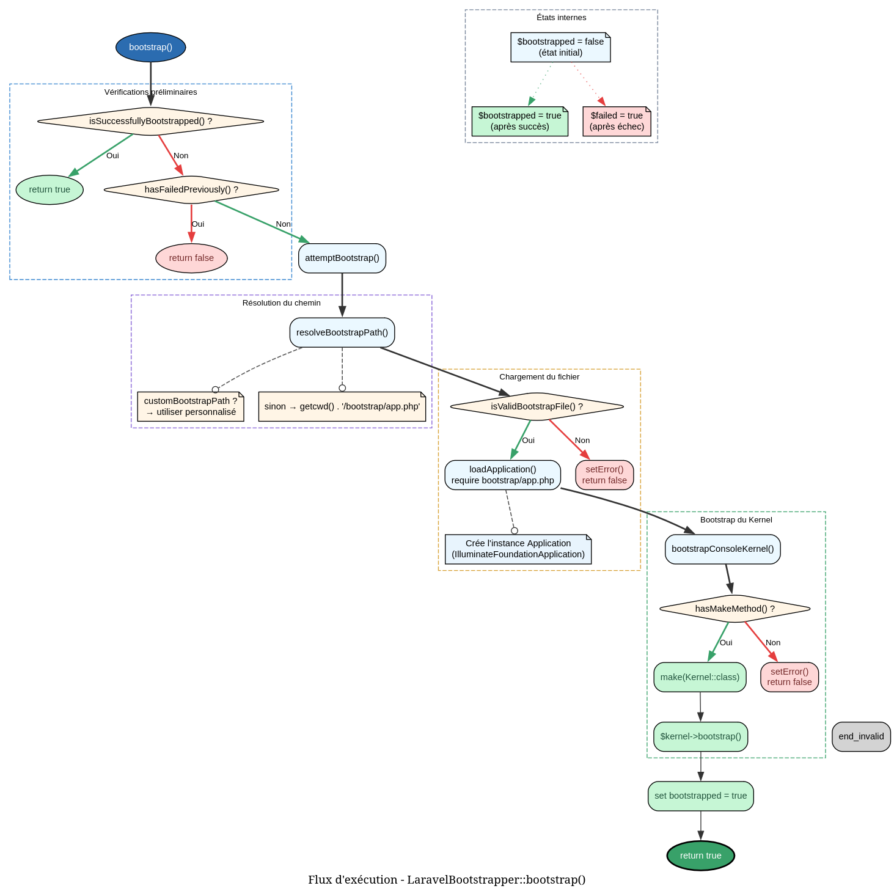

# LaravelBootstrapper - Référence Technique

## Description

Service responsable du bootstrap de l'application Laravel lorsqu'elle est nécessaire pour l'exécution des directives.

## Hiérarchie

```
Aucune hiérarchie - Classe finale sans extension ni implémentation
```

## Rôle principal

Cette classe agit comme un pont entre les directives du package et l'application Laravel. Elle localise, charge et initialise l'application Laravel à la demande, puis met en cache le résultat pour éviter les tentatives de bootstrap répétées. Utilisée automatiquement par les directives qui nécessitent l'intégration Laravel.

## Installation

```bash
composer require andydefer/php-records
```

**Prérequis :**
- Laravel 8.x, 9.x, 10.x ou 11.x (optionnel - le package fonctionne sans)
- Accès en lecture au fichier `bootstrap/app.php`

```php
$bootstrapper = new LaravelBootstrapper();

if ($bootstrapper->bootstrap()) {
    $app = $bootstrapper->getApplication();
    // Utiliser Laravel
}
```

## API / Méthodes publiques

### `setCustomBootstrapPath(string $path): self`

| Paramètre | Type | Description |
|-----------|------|-------------|
| `$path` | `string` | Chemin vers le fichier `bootstrap/app.php` de Laravel |

**Retourne :** `self` - Retourne l'instance pour le chaînage

Définit un chemin personnalisé vers le fichier bootstrap de Laravel. Utile pour les tests ou les installations non standard.

**Exemple :**
```php
$bootstrapper = (new LaravelBootstrapper())
    ->setCustomBootstrapPath('/var/www/laravel/bootstrap/app.php');
```

### `bootstrap(): bool`

Tente de charger et d'initialiser l'application Laravel.

**Retourne :** `bool` - `true` si Laravel est bootstrappé avec succès, `false` sinon

**Comportement :**
- Cache le résultat : les appels ultérieurs retournent la même valeur
- Évite les tentatives multiples si une erreur s'est produite

**Exemple :**
```php
if ($bootstrapper->bootstrap()) {
    echo "Laravel est prêt";
} else {
    echo "Erreur: " . $bootstrapper->getError();
}
```

### `isBootstrapped(): bool`

Vérifie si Laravel a été bootstrappé avec succès.

**Retourne :** `bool` - `true` si Laravel est bootstrappé, `false` sinon

**Exemple :**
```php
if (!$bootstrapper->isBootstrapped()) {
    $bootstrapper->bootstrap();
}
```

### `getApplication(): ?object`

Récupère l'instance de l'application Laravel.

**Retourne :** `object|null` - Instance de l'application Laravel ou `null` si non bootstrappée

⚠️ **Note :** Le type de retour est `object` pour éviter une dépendance directe. L'objet retourné est une instance de `Illuminate\Foundation\Application`.

**Exemple :**
```php
$app = $bootstrapper->getApplication();
if ($app) {
    $version = $app->version();
    echo "Laravel version: {$version}";
}
```

### `getError(): ?string`

Récupère le dernier message d'erreur si le bootstrap a échoué.

**Retourne :** `string|null` - Message d'erreur ou `null` si aucune erreur

**Exemple :**
```php
if (!$bootstrapper->bootstrap()) {
    error_log($bootstrapper->getError());
}
```

### `reset(): void`

Réinitialise complètement l'état du bootstrapper.

**Effets :**
- Réinitialise le statut `bootstrapped`
- Supprime l'instance de l'application
- Efface le message d'erreur
- Supprime le chemin personnalisé

**Exemple :**
```php
// Après un échec
$bootstrapper->bootstrap(); // false

// Réinitialiser pour réessayer
$bootstrapper->reset();

// Nouvelle tentative
$bootstrapper->bootstrap();
```

## Cas d'utilisation

### Cas 1 : Directive Laravel avec accès aux services

**Problème :** Une directive a besoin d'accéder aux services Laravel (base de données, cache, etc.).

```php
class CacheClearDirective
{
    private LaravelBootstrapper $laravel;
    
    public function __construct(LaravelBootstrapper $laravel)
    {
        $this->laravel = $laravel;
    }
    
    public function execute(): void
    {
        if (!$this->laravel->bootstrap()) {
            throw new RuntimeException('Laravel required: ' . $this->laravel->getError());
        }
        
        $app = $this->laravel->getApplication();
        $cache = $app->make('cache');
        $cache->flush();
        
        echo "Cache cleared successfully\n";
    }
}
```

### Cas 2 : Commande avec fallback pour environnement non-Laravel

**Problème :** Une directive peut être exécutée avec ou sans Laravel.

```php
class ConfigShowDirective
{
    private LaravelBootstrapper $laravel;
    
    public function execute(string $key): void
    {
        if ($this->laravel->bootstrap()) {
            $app = $this->laravel->getApplication();
            $value = $app->make('config')->get($key);
        } else {
            // Fallback pour environnement non-Laravel
            $value = getenv($key) ?: "not set";
        }
        
        echo "{$key} = {$value}\n";
    }
}
```

### Cas 3 : Tests unitaires avec chemin personnalisé

**Problème :** Tester le bootstrapper dans un environnement de test dédié.

```php
class CustomBootstrapTest extends TestCase
{
    public function testWithCustomLaravelPath(): void
    {
        $bootstrapper = new LaravelBootstrapper();
        $bootstrapper->setCustomBootstrapPath(__DIR__ . '/fixtures/bootstrap/app.php');
        
        $result = $bootstrapper->bootstrap();
        
        $this->assertTrue($result);
        $this->assertInstanceOf(Application::class, $bootstrapper->getApplication());
    }
}
```

### Cas 4 : Cache des résultats pour les appels multiples

**Problème :** Plusieurs directives appelées en séquence ne doivent pas recharger Laravel.

```php
class CommandBus
{
    private LaravelBootstrapper $laravel;
    
    public function handle(Command $command): void
    {
        // Premier appel : charge Laravel
        $this->laravel->bootstrap();
        
        // Appels suivants : retournent immédiatement
        $this->executeCommand($command);
        $this->logExecution($command); // Nouvel appel
        $this->notifyComplete($command); // Nouvel appel
    }
}
```

### Cas 5 : Gestion des erreurs avec réinitialisation

**Problème :** Après une erreur, permettre une nouvelle tentative après correction.

```php
class ResilientCommandRunner
{
    private LaravelBootstrapper $laravel;
    
    public function run(): void
    {
        $attempts = 0;
        $maxAttempts = 3;
        
        while ($attempts < $maxAttempts) {
            if ($this->laravel->bootstrap()) {
                $this->execute();
                return;
            }
            
            $error = $this->laravel->getError();
            echo "Attempt " . ($attempts + 1) . " failed: {$error}\n";
            
            $this->laravel->reset();
            $attempts++;
            
            // Attendre avant de réessayer
            sleep(1);
        }
        
        throw new RuntimeException("Failed to bootstrap Laravel after {$maxAttempts} attempts");
    }
}
```

## Flux d'exécution



## Gestion des erreurs

| Situation | Message d'erreur | Comportement |
|-----------|------------------|--------------|
| Fichier bootstrap introuvable | `Laravel bootstrap file not found at: {path}` | Retourne `false`, l'erreur est mise en cache |
| Exception lors du chargement | `Failed to bootstrap Laravel: {exception message}` | Retourne `false`, l'exception est capturée |
| Fichier non lisible | Même que fichier introuvable | Retourne `false` |
| Kernel console non disponible | Pas d'erreur spécifique | Continue sans bootstrapper le kernel |

## Intégration

### Avec les directives Laravel

```php
use AndyDefer\Directive\Attributes\AsDirective;
use AndyDefer\Directive\Services\LaravelBootstrapper;

#[AsDirective(name: 'laravel:info')]
class LaravelInfoDirective
{
    public function __construct(
        private LaravelBootstrapper $laravel
    ) {}
    
    public function __invoke(): void
    {
        if (!$this->laravel->bootstrap()) {
            echo "This command requires Laravel.\n";
            return;
        }
        
        $app = $this->laravel->getApplication();
        echo "Laravel version: " . $app->version() . "\n";
        echo "Environment: " . $app->environment() . "\n";
    }
}
```

### Avec le container d'injection

```php
// Configuration du container
$container->singleton(LaravelBootstrapper::class, function () {
    $bootstrapper = new LaravelBootstrapper();
    
    // Configuration automatique pour Laravel
    if (defined('LARAVEL_BOOTSTRAP_PATH')) {
        $bootstrapper->setCustomBootstrapPath(LARAVEL_BOOTSTRAP_PATH);
    }
    
    return $bootstrapper;
});
```

### Pattern Singleton implicite

Le bootstrapper maintient son propre état interne, agissant comme un singleton implicite pour le processus.

```php
// Premier appel - charge Laravel
$bootstrapper1 = new LaravelBootstrapper();
$bootstrapper1->bootstrap();

// Deuxième appel - utilise le cache interne
$bootstrapper2 = new LaravelBootstrapper();
$bootstrapper2->bootstrap(); // Retourne immédiatement
```

## Performance

- **Complexité temporelle :** O(1) après le premier appel (caching)
- **Premier appel :** Variable selon la complexité de l'application Laravel (50-200ms typique)
- **Mémoire :** Stocke l'application en mémoire (plusieurs Mo selon l'application)
- **Accès disque :** Un seul `file_exists()` et `require()` pour le bootstrap

### Optimisation

```php
// Bon - le cache fonctionne
for ($i = 0; $i < 100; $i++) {
    $bootstrapper->bootstrap(); // Premier appel : lent, 99 suivants : rapide
}

// Mieux - éviter de créer plusieurs instances
$bootstrapper = new LaravelBootstrapper(); // Une seule instance partagée
```

## Compatibilité

| Version PHP | Support |
|-------------|---------|
| PHP 8.1+ | ✅ Complet |
| PHP 8.0 | ⚠️ Limité (méthodes `readonly` non supportées) |

| Version Laravel | Support |
|----------------|---------|
| Laravel 11.x | ✅ Testé |
| Laravel 10.x | ✅ Testé |
| Laravel 9.x | ✅ Testé |
| Laravel 8.x | ✅ Testé |
| Laravel 7.x | ⚠️ Non testé |

## Exemple complet

```php
<?php

declare(strict_types=1);

use AndyDefer\Directive\Services\LaravelBootstrapper;

// ==================== Initialisation ====================

$bootstrapper = new LaravelBootstrapper();

// Optionnel : Définir un chemin personnalisé
$bootstrapper->setCustomBootstrapPath('/var/www/myapp/bootstrap/app.php');

// ==================== Bootstrap ====================

echo "Attempting to bootstrap Laravel...\n";

if (!$bootstrapper->bootstrap()) {
    echo "❌ Failed to bootstrap Laravel\n";
    echo "Error: " . $bootstrapper->getError() . "\n";
    exit(1);
}

echo "✅ Laravel bootstrapped successfully\n";

// ==================== Accès à l'application ====================

$app = $bootstrapper->getApplication();

if ($app) {
    // Version de Laravel
    echo "\n--- Application Info ---\n";
    echo "Version: " . $app->version() . "\n";
    echo "Environment: " . $app->environment() . "\n";
    echo "Base path: " . $app->basePath() . "\n";
    
    // Accès aux services
    echo "\n--- Services ---\n";
    
    // Cache
    $cache = $app->make('cache');
    $cache->put('laravel_bootstrapper_test', 'working', 60);
    echo "Cache: " . $cache->get('laravel_bootstrapper_test') . "\n";
    
    // Config
    $config = $app->make('config');
    echo "App name: " . $config->get('app.name', 'Not set') . "\n";
    echo "App debug: " . ($config->get('app.debug') ? 'true' : 'false') . "\n";
    
    // Database (optionnel)
    try {
        $db = $app->make('db');
        $results = $db->select('SELECT 1 as test');
        echo "Database: Connected\n";
    } catch (Exception $e) {
        echo "Database: Not available\n";
    }
}

// ==================== Démonstration du cache ====================

echo "\n--- Cache Demonstration ---\n";

$start = microtime(true);
$bootstrapper->bootstrap(); // Premier appel (déjà fait)
$time = microtime(true) - $start;
echo "Second bootstrap call: {$time} seconds (cached)\n";

// ==================== Gestion des erreurs ====================

echo "\n--- Error Handling ---\n";

// Simuler une erreur avec un chemin invalide
$invalidBootstrapper = new LaravelBootstrapper();
$invalidBootstrapper->setCustomBootstrapPath('/invalid/path/bootstrap.php');

if (!$invalidBootstrapper->bootstrap()) {
    echo "Expected error: " . $invalidBootstrapper->getError() . "\n";
}

// ==================== Réinitialisation ====================

echo "\n--- Reset Demonstration ---\n";

$bootstrapper->reset();
echo "State after reset:\n";
echo "- Bootstrapped: " . ($bootstrapper->isBootstrapped() ? 'true' : 'false') . "\n";
echo "- Application: " . ($bootstrapper->getApplication() ? 'exists' : 'null') . "\n";
echo "- Error: " . ($bootstrapper->getError() ?? 'null') . "\n";

// Nouveau bootstrap après reset
if ($bootstrapper->bootstrap()) {
    echo "Successfully re-bootstrapped after reset\n";
}

// ==================== Exemple d'intégration avec directive ====================

class LaravelStatusDirective
{
    private LaravelBootstrapper $laravel;
    
    public function __construct(LaravelBootstrapper $laravel)
    {
        $this->laravel = $laravel;
    }
    
    public function execute(): void
    {
        if (!$this->laravel->bootstrap()) {
            echo "❌ Laravel is not available\n";
            echo "Reason: " . $this->laravel->getError() . "\n";
            return;
        }
        
        $app = $this->laravel->getApplication();
        
        echo "✅ Laravel is running\n";
        echo "Version: " . $app->version() . "\n";
        
        $environment = $app->environment();
        $color = $environment === 'production' ? '🟢' : ($environment === 'local' ? '🔵' : '🟡');
        echo "Environment: {$color} {$environment}\n";
    }
}

// Exécution
$directive = new LaravelStatusDirective($bootstrapper);
$directive->execute();
```
---