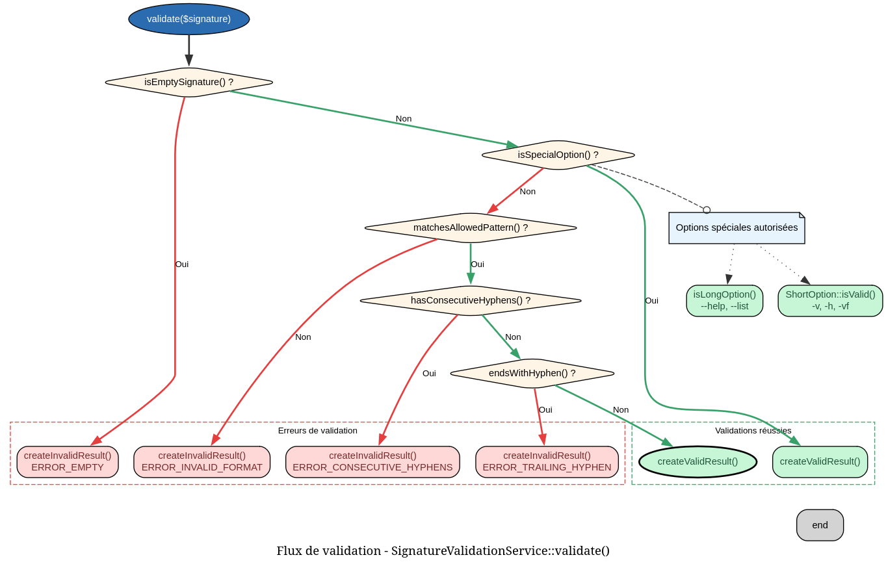

```markdown
# SignatureValidationService - Référence Technique

## Description

Valide les signatures de directives pour garantir leur conformité avec le format attendu.

## Hiérarchie

```
Aucune hiérarchie - Classe finale sans extension ni implémentation
```

## Rôle principal

Assure que les noms de directives respectent les règles de formatage :
- Commencent par une lettre
- Contiennent uniquement des lettres, chiffres et tirets
- Pas de tirets consécutifs
- Ne se terminent pas par un tiret

Accepte également les cas spéciaux comme les options longues (`--help`) et les options courtes (`-v`).

## Installation

```bash
composer require andydefer/php-records
```

Aucune configuration supplémentaire requise.

```php
$validator = new SignatureValidationService();
$result = $validator->validate('user-create');
```

## API / Méthodes publiques

### `validate(string $signature): ValidationResultRecord`

| Paramètre | Type | Description |
|-----------|------|-------------|
| `$signature` | `string` | Signature de la directive à valider |

**Retourne :** `ValidationResultRecord` - Enregistrement contenant le statut de validation et un message d'erreur si invalide

**Exceptions :** Aucune

**Exemple :**
```php
$validator = new SignatureValidationService();

$result = $validator->validate('user-create');
if ($result->isValid) {
    echo "Signature valide";
} else {
    echo "Erreur : " . $result->error;
}
```

## Cas d'utilisation

### Cas 1 : Validation d'une commande avant enregistrement

**Problème :** Vérifier qu'une nouvelle commande respecte les conventions de nommage avant de l'ajouter au registre.

```php
class DirectiveRegistry
{
    private SignatureValidationService $validator;
    private array $directives = [];
    
    public function register(string $name, callable $handler): void
    {
        $result = $this->validator->validate($name);
        
        if (!$result->isValid) {
            throw new InvalidArgumentException($result->error);
        }
        
        $this->directives[$name] = $handler;
    }
}
```

### Cas 2 : Validation interactive dans un assistant de création

**Problème :** Guider l'utilisateur dans la création d'une nouvelle commande avec validation en temps réel.

```php
class DirectiveCreator
{
    private SignatureValidationService $validator;
    
    public function createInteractive(): void
    {
        do {
            $name = readline("Enter directive name: ");
            $result = $this->validator->validate($name);
            
            if (!$result->isValid) {
                echo "Error: " . $result->error . "\n";
                echo "Examples: user-create, cache-clear, db-migrate\n";
            }
        } while (!$result->isValid);
        
        // Créer la directive avec le nom valide
        $this->createDirective($name);
    }
}
```

### Cas 3 : Filtrage des options spéciales

**Problème :** Distinguer les noms de commandes standards des options système comme `--help` ou `-v`.

```php
class CommandRouter
{
    private SignatureValidationService $validator;
    
    public function route(string $input): void
    {
        $result = $this->validator->validate($input);
        
        if (!$result->isValid) {
            $this->showError($result->error);
            return;
        }
        
        // Les options spéciales sont valides mais ne sont pas des commandes
        if ($input === '--help' || $input === '-h') {
            $this->showHelp();
            return;
        }
        
        $this->executeCommand($input);
    }
}
```

### Cas 4 : Validation batch de plusieurs signatures

**Problème :** Valider un lot de signatures et collecter toutes les erreurs.

```php
class BatchValidator
{
    private SignatureValidationService $validator;
    
    public function validateAll(array $signatures): array
    {
        $errors = [];
        
        foreach ($signatures as $signature) {
            $result = $this->validator->validate($signature);
            
            if (!$result->isValid) {
                $errors[$signature] = $result->error;
            }
        }
        
        return $errors;
    }
}
```

### Cas 5 : Intégration dans un système de plugins

**Problème :** Vérifier que les plugins tiers respectent les conventions de nommage.

```php
class PluginLoader
{
    private SignatureValidationService $validator;
    
    public function loadPlugin(string $pluginClass): void
    {
        $plugin = new $pluginClass();
        $commandName = $plugin->getCommandName();
        
        $result = $this->validator->validate($commandName);
        
        if (!$result->isValid) {
            throw new PluginException(
                "Plugin '{$pluginClass}' has invalid command name '{$commandName}': {$result->error}"
            );
        }
        
        $this->registerPlugin($commandName, $plugin);
    }
}
```

## Flux d'exécution



## Règles de validation

### Format standard

| Règle | Description | Exemple valide | Exemple invalide |
|-------|-------------|----------------|------------------|
| Commence par une lettre | `[a-zA-Z]` | `user-create` | `1user` |
| Caractères autorisés | lettres, chiffres, tirets | `api-v2` | `user_create` |
| Pas de tirets consécutifs | `--` interdit | `user-create` | `user--create` |
| Pas de tiret final | ne peut pas se terminer par `-` | `user-create` | `user-create-` |

### Options spéciales

| Type | Format | Exemples |
|------|--------|----------|
| Option longue | `--` + lettre(s) | `--help`, `--force`, `--verbose` |
| Option courte | `-` + lettre | `-h`, `-v`, `-f` |
| Options courtes groupées | `-` + lettres multiples | `-vfh`, `-la` |

## Gestion des erreurs

| Situation | Message d'erreur |
|-----------|------------------|
| Signature vide | `Directive name cannot be empty` |
| Format invalide | `Invalid directive name: "{name}". Use only letters, numbers, and hyphens. Must start with a letter. No spaces. Examples: user-create, clean-log, db-migrate-fresh` |
| Tirets consécutifs | `Invalid directive name: "{name}". Cannot have consecutive hyphens` |
| Tiret final | `Invalid directive name: "{name}". Cannot end with a hyphen` |

## Intégration

### Avec ShortOption enum

```php
// Délégation des short options à l'enum
if (ShortOption::isValid($signature)) {
    return $this->createValidResult();
}
```

### Avec ValidationResultRecord

```php
$result = $validator->validate('user-create');

// Vérification simple
if ($result->isValid) {
    // Procéder
}

// Récupération de l'erreur
if (!$result->isValid) {
    $this->logger->error($result->error);
}
```

### Dans une application console

```php
class ConsoleApplication
{
    private SignatureValidationService $validator;
    private CommandRegistry $registry;
    
    public function run(string $input): void
    {
        // Extraire le nom de la commande
        $parts = explode(' ', trim($input));
        $commandName = $parts[0];
        
        // Valider
        $result = $this->validator->validate($commandName);
        
        if (!$result->isValid) {
            echo "Error: " . $result->error . "\n";
            echo "Type 'help' for available commands.\n";
            return;
        }
        
        // Exécuter
        $this->registry->execute($commandName, array_slice($parts, 1));
    }
}
```

## Performance

- **Complexité temporelle :** O(n) où n est la longueur de la signature
- **Opérations :**
  - 1 expression régulière (validité du format)
  - 3 recherches de chaîne (`str_starts_with`, `str_contains`, `str_ends_with`)
  - Délégation à `ShortOption::isValid()` pour les options courtes
- **Optimisation :** Les validations sont chaînées par ordre de complexité croissante (les cas les plus simples sont traités d'abord)

### Benchmark indicatif

| Longueur signature | Temps moyen |
|-------------------|-------------|
| 10 caractères | ~0.5 µs |
| 50 caractères | ~1.2 µs |
| 100 caractères | ~2.0 µs |

## Compatibilité

| Version PHP | Support |
|-------------|---------|
| PHP 8.3+ | ✅ Complet (constantes typées) |
| PHP 8.2 | ✅ Complet |
| PHP 8.1 | ✅ Complet |
| PHP 8.0 | ⚠️ Limité (retourne `static` au lieu de `self`) |

## Exemple complet

```php
<?php

declare(strict_types=1);

use AndyDefer\Directive\Services\SignatureValidationService;

$validator = new SignatureValidationService();

// ==================== Tests de validation ====================

$testCases = [
    // Valides
    'user-create' => true,
    'list' => true,
    'db-migrate-fresh' => true,
    'api-v2' => true,
    'user-create2' => true,
    '--help' => true,
    '-h' => true,
    '-vf' => true,
    'a' => true,
    'UserCreate' => true,
    
    // Invalides
    '' => false,
    'user create' => false,
    'user@create' => false,
    'user:create' => false,
    'user_create' => false,
    '123-user' => false,
    '-user' => false,
    'user--create' => false,
    'user-create-' => false,
    '123' => false,
    'user$create' => false,
];

echo "Signature Validation Tests\n";
echo "==========================\n\n";

foreach ($testCases as $signature => $shouldBeValid) {
    $result = $validator->validate($signature);
    $status = $result->isValid ? '✓ VALID' : '✗ INVALID';
    $expected = $shouldBeValid ? 'VALID' : 'INVALID';
    $match = ($result->isValid === $shouldBeValid) ? '✅' : '❌';
    
    echo sprintf(
        "%s %-20s : %s (expected: %s)\n",
        $match,
        "'{$signature}'",
        $status,
        $expected
    );
    
    if (!$result->isValid) {
        echo "    Error: {$result->error}\n";
    }
}

// ==================== Utilisation pratique ====================

echo "\n\nPractical Usage Example\n";
echo "=======================\n\n";

function registerCommand(SignatureValidationService $validator, string $name, callable $handler): void
{
    $result = $validator->validate($name);
    
    if (!$result->isValid) {
        throw new InvalidArgumentException(
            "Cannot register command '{$name}': {$result->error}"
        );
    }
    
    echo "✓ Command '{$name}' registered successfully\n";
    // Stocker le handler...
}

// Enregistrement de commandes
try {
    registerCommand($validator, 'cache-clear', fn() => 'Clearing cache...');
    registerCommand($validator, 'user:create', fn() => 'Creating user...'); // Invalide
} catch (InvalidArgumentException $e) {
    echo "Error: " . $e->getMessage() . "\n";
}

// ==================== Filtrage des options ====================

echo "\nSpecial Options Detection\n";
echo "========================\n";

$inputs = ['--help', '-v', '-vf', 'user-create', '--'];

foreach ($inputs as $input) {
    $result = $validator->validate($input);
    
    if ($result->isValid && (str_starts_with($input, '--') || str_starts_with($input, '-'))) {
        echo "✓ '{$input}' is a valid special option\n";
    } elseif ($result->isValid) {
        echo "✓ '{$input}' is a valid command name\n";
    } else {
        echo "✗ '{$input}' is invalid: {$result->error}\n";
    }
}
```
---