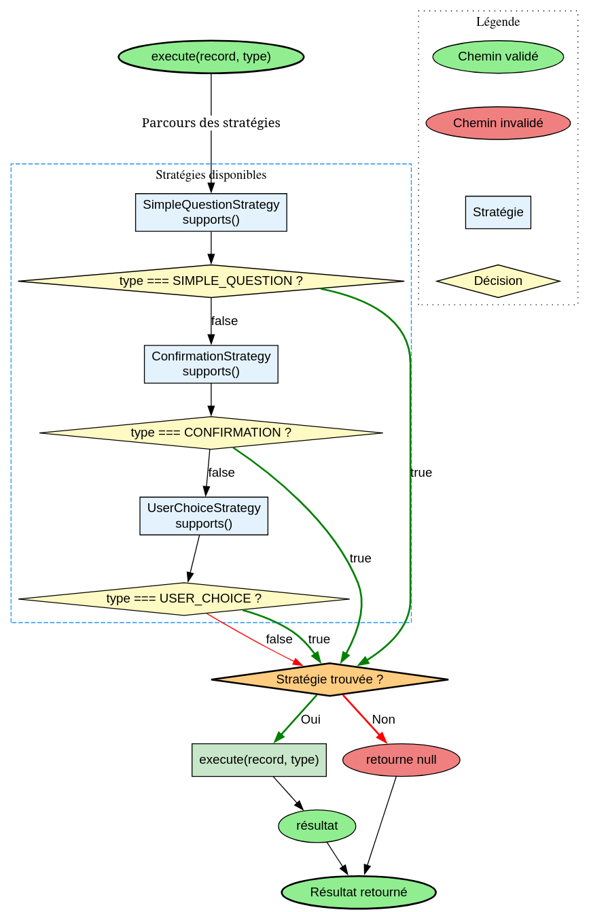

# InputDispatcher - Référence Technique

## Description

Task responsable de la gestion des interactions utilisateur en ligne de commande. Utilise le pattern Strategy pour déléguer différents types d'entrée (questions simples, confirmations, choix utilisateur) à des stratégies spécialisées.

## Hiérarchie

```
InputDispatcher (final)
    └── Utilise : InputStrategyInterface
            ├── SimpleQuestionStrategy
            ├── ConfirmationStrategy
            └── UserChoiceStrategy
```

## Rôle principal

Centraliser la logique d'interaction utilisateur. Gère le flux d'entrée standard, sélectionne la stratégie appropriée selon le type d'entrée demandé et exécute la capture de la réponse utilisateur.

## Installation

```bash
composer require andydefer/laravel-directive
```

## API / Méthodes publiques

### `execute(object $record, InputType $type): mixed`

Exécute la stratégie d'entrée pour l'enregistrement et le type donnés.

| Paramètre | Type | Description |
|-----------|------|-------------|
| `$record` | `object` | Enregistrement contenant la configuration de l'entrée (`QuestionRecord`, `UserChoiceRecord`) |
| `$type` | `InputType` | Type d'entrée à effectuer (`SIMPLE_QUESTION`, `CONFIRMATION`, `USER_CHOICE`) |

**Retourne :** `mixed` - Le résultat de l'entrée utilisateur, ou `null` si aucune stratégie ne supporte le type

**Exemple :**
```php
$task = new InputDispatcher();
$record = new QuestionRecord('What is your name?');
$name = $task->execute($record, InputType::SIMPLE_QUESTION);
```

## Cas d'utilisation

### Cas 1 : Question simple

```php
$task = new InputDispatcher();
$record = new QuestionRecord('What is your name?');
$name = $task->execute($record, InputType::SIMPLE_QUESTION);
// Affiche: "What is your name? " 
// Attend la saisie utilisateur, retourne la valeur trimée
```

### Cas 2 : Confirmation (Oui/Non)

```php
$task = new InputDispatcher();
$record = new QuestionRecord('Do you want to continue?');
$confirmed = $task->execute($record, InputType::CONFIRMATION);
// Affiche: "Do you want to continue? (y/n) "
// Retourne true pour 'y'/'yes', false pour 'n'/'no'
```

### Cas 3 : Choix utilisateur

```php
$task = new InputDispatcher();
$record = new UserChoiceRecord(choice: 0, max: 5);
$choice = $task->execute($record, InputType::USER_CHOICE);
// Affiche: "Which one do you want to use? [1-5]: "
// Retourne l'entier choisi (1-5) ou null si invalide
```

## Flux d'exécution

## Gestion des erreurs

| Situation | Comportement |
|-----------|--------------|
| Type non supporté | `execute()` retourne `null` |
| Record incompatible avec la stratégie | Stratégie retourne valeur par défaut (chaîne vide, false, null) |
| Entrée utilisateur invalide | Validation spécifique à chaque stratégie |
| Flux d'entrée indisponible | Exception selon l'implémentation PHP |

## Intégration

`InputDispatcher` s'intègre avec :

- **`DirectiveInteractionService`** : Utilise la task pour les interactions utilisateur
- **`InputStrategyInterface`** : Interface que toutes les stratégies implémentent
- **`QuestionRecord`** : Enregistrement pour les questions et confirmations
- **`UserChoiceRecord`** : Enregistrement pour les choix utilisateur
- **`InputType`** : Enum définissant les types d'entrée disponibles

## Strategies disponibles

| Stratégie | Type supporté | Description |
|-----------|---------------|-------------|
| `SimpleQuestionStrategy` | `SIMPLE_QUESTION` | Question simple, retourne la réponse brute |
| `ConfirmationStrategy` | `CONFIRMATION` | Confirmation Oui/Non, retourne booléen |
| `UserChoiceStrategy` | `USER_CHOICE` | Choix dans une plage, retourne entier ou null |

## Détail des stratégies

### SimpleQuestionStrategy

- **Affiche** : `question + suffixe (espace)`
- **Lit** : Une ligne de l'entrée standard
- **Retourne** : La ligne lue, trimée
- **Erreur** : Retourne une chaîne vide si record invalide

### ConfirmationStrategy

- **Affiche** : `question + suffixe " (y/n)"`
- **Lit** : Une ligne de l'entrée standard
- **Retourne** : `true` pour `y`/`yes` (insensible à la casse), `false` sinon
- **Erreur** : Retourne `false` si record invalide

### UserChoiceStrategy

- **Affiche** : `"Which one do you want to use? [1-{max}]: "`
- **Lit** : Une ligne de l'entrée standard
- **Valide** : Entier entre 1 et `max`
- **Retourne** : L'entier choisi, ou `null` si invalide
- **Erreur** : Retourne `null` si record invalide

## Performance

| Aspect | Caractéristique |
|--------|----------------|
| Sélection de stratégie | O(n) avec n = nombre de stratégies (3 actuellement) |
| Lecture entrée | Dépend de l'utilisateur (temps réel) |
| Validation | O(1) par stratégie |
| Mémoire | Une instance par appel (partagée via injection) |

## Compatibilité

| Version | Support |
|---------|---------|
| PHP 8.1+ | ✅ Requis |
| PHP 8.2+ | ✅ Complet |
| PHP 8.3+ | ✅ Complet |

## Exemple complet

```php
<?php

declare(strict_types=1);

use AndyDefer\Directive\Enums\InputType;
use AndyDefer\Directive\Records\QuestionRecord;
use AndyDefer\Directive\Records\UserChoiceRecord;
use AndyDefer\Directive\Dispatchers\InputDispatcher;

// 1. Créer une instance du InputDispatcher
$inputDispatcher = new InputDispatcher();

// 2. Question simple
$nameRecord = new QuestionRecord('What is your name?');
$name = $inputDispatcher->execute($nameRecord, InputType::SIMPLE_QUESTION);
echo "Hello, {$name}!\n";

// 3. Confirmation
$confirmRecord = new QuestionRecord('Do you want to save?');
if ($inputDispatcher->execute($confirmRecord, InputType::CONFIRMATION)) {
    echo "Saving...\n";
} else {
    echo "Cancelled.\n";
}

// 4. Choix utilisateur
$choiceRecord = new UserChoiceRecord(choice: 0, max: 3);
$choice = $inputDispatcher->execute($choiceRecord, InputType::USER_CHOICE);

if ($choice !== null) {
    echo "You selected option {$choice}\n";
} else {
    echo "Invalid selection\n";
}
```
---