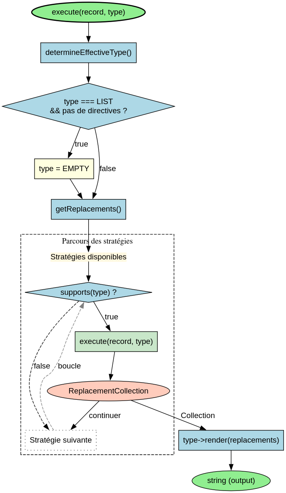

# RenderDispatcher - Référence Technique

## Description

Task responsable du rendu des différents types de sorties (aide, liste, messages, tableaux, etc.) en utilisant le pattern Strategy. Délègue le rendu à des stratégies spécialisées selon le type demandé.

## Hiérarchie

```
RenderDispatcher (final)
    └── Utilise : RenderStrategyInterface (via les stratégies concrètes)
```

## Rôle principal

Centraliser la logique de rendu des directives CLI. Gère les fallbacks (ex: LIST sans directives → EMPTY), sélectionne la stratégie appropriée et exécute le rendu avec les remplacements de variables.

## Installation

```bash
composer require andydefer/laravel-directive
```

## API / Méthodes publiques

### `execute(object $record, RenderType $type): string`

Exécute le processus de rendu pour l'enregistrement et le type donnés.

| Paramètre | Type | Description |
|-----------|------|-------------|
| `$record` | `object` | Enregistrement contenant les données à rendre (ex: `RenderRecord`, `ConflictDisplayRecord`) |
| `$type` | `RenderType` | Type de rendu à effectuer (`HELP`, `LIST`, `SUCCESS`, `ERROR`, etc.) |

**Retourne :** `string` - Le contenu rendu (prêt à être affiché)

**Exemple :**
```php
$task = new RenderDispatcher();
$record = new RenderRecord(type: RenderType::HELP);
$output = $task->execute($record, RenderType::HELP);
echo $output;
```

## Cas d'utilisation

### Cas 1 : Rendu de l'aide

```php
$record = new RenderRecord(type: RenderType::HELP);
$output = $this->renderDispatcher->execute($record, RenderType::HELP);
// Affiche l'aide complète du système de directives
```

### Cas 2 : Rendu de la liste des directives

```php
$directives = new DirectiveMetadataCollection();
$directives->add(new DirectiveMetadataRecord(...));

$record = new RenderRecord(type: RenderType::LIST, directives: $directives);
$output = $this->renderDispatcher->execute($record, RenderType::LIST);
// Affiche la liste formatée des directives disponibles
```

### Cas 3 : Rendu d'un message de succès

```php
$record = new RenderRecord(type: RenderType::SUCCESS, message: 'Operation completed');
$output = $this->renderDispatcher->execute($record, RenderType::SUCCESS);
// Affiche "Operation completed" en vert avec icône ✓
```

### Cas 4 : Rendu d'un conflit d'alias

```php
$record = new ConflictDisplayRecord(
    name: 'user-create',
    classNames: new StringTypedCollection(['UserCreateDirective', 'AdminUserCreateDirective']),
    signatures: new StringTypedCollection(['user-create', 'admin-user-create']),
    descriptions: new StringTypedCollection(['Create user', 'Create admin user']),
);
$output = $this->renderDispatcher->execute($record, RenderType::CONFLICT);
// Affiche les directives en conflit avec choix interactif
```

## Flux d'exécution



## Gestion des erreurs

| Situation | Comportement |
|-----------|--------------|
| Aucune stratégie ne supporte le type | Retourne `ReplacementCollection` vide → rendu minimal |
| `RenderRecord` avec `directives` null pour LIST | Fallback vers type `EMPTY` |
| Enregistrement non supporté par la stratégie | La stratégie doit gérer l'erreur en interne |
| Template de rendu invalide | L'exception est propagée (gérée par l'appelant) |

## Intégration

`RenderDispatcher` s'intègre avec :

- **`DirectiveRendererService`** : Utilise la task pour générer les sorties
- **`RenderStrategyInterface`** : Interface que toutes les stratégies implémentent
- **`ReplacementCollection`** : Collection des remplacements pour les templates
- **`RenderType`** : Enum définissant les types de rendu disponibles

## Strategies disponibles

| Stratégie | Type supporté | Description |
|-----------|---------------|-------------|
| `HelpRenderStrategy` | `HELP` | Affiche l'aide générale |
| `ListRenderStrategy` | `LIST`, `EMPTY` | Affiche la liste des directives |
| `NotFoundRenderStrategy` | `NOT_FOUND` | Affiche une erreur "directive non trouvée" |
| `MessageRenderStrategy` | `SUCCESS`, `ERROR` | Affiche des messages simples |
| `ConflictRenderStrategy` | `CONFLICT` | Affiche les conflits d'alias |
| `TableRenderStrategy` | `TABLE` | Affiche un tableau formaté |
| `ValidationErrorRenderStrategy` | `VALIDATION_ERROR` | Affiche les erreurs de validation |
| `DisplayMessageRenderStrategy` | `DISPLAY_MESSAGE` | Affiche des messages formatés |
| `WarningRenderStrategy` | `WARNING` | Affiche des avertissements |
| `DebugRenderStrategy` | `DEBUG` | Affiche des messages de debug |
| `VersionRenderStrategy` | `VERSION` | Affiche les informations de version |

## Performance

| Aspect | Caractéristique |
|--------|----------------|
| Sélection de stratégie | O(n) avec n = nombre de stratégies (11 actuellement) |
| Rendu | Dépend de la stratégie et de la taille des données |
| Cache | Aucun mécanisme de cache interne |
| Mémoire | Une instance par appel (partagée via injection) |

## Compatibilité

| Version | Support |
|---------|---------|
| PHP 8.1+ | ✅ Requis (readonly properties, union types) |
| PHP 8.2+ | ✅ Complet |
| PHP 8.3+ | ✅ Complet |

## Exemple complet

```php
<?php

declare(strict_types=1);

use AndyDefer\Directive\Enums\RenderType;
use AndyDefer\Directive\Records\RenderRecord;
use AndyDefer\Directive\Dispatchers\RenderDispatcher;

// 1. Créer une instance du RenderDispatcher
$renderDispatcher = new RenderDispatcher();

// 2. Rendre l'aide
$helpRecord = new RenderRecord(type: RenderType::HELP);
echo $renderDispatcher->execute($helpRecord, RenderType::HELP);

// 3. Rendre une liste de directives
$directives = new DirectiveMetadataCollection();
$directives->add(new DirectiveMetadataRecord(
    signature: 'user-create',
    class: UserCreateDirective::class,
    description: 'Create a new user',
    aliases: new StringTypedCollection(),
));

$listRecord = new RenderRecord(type: RenderType::LIST, directives: $directives);
echo $renderDispatcher->execute($listRecord, RenderType::LIST);

// 4. Rendre un message de succès
$successRecord = new RenderRecord(type: RenderType::SUCCESS, message: 'User created successfully');
echo $renderDispatcher->execute($successRecord, RenderType::SUCCESS);

// 5. Rendre une erreur
$errorRecord = new RenderRecord(type: RenderType::ERROR, message: 'Failed to create user');
echo $renderDispatcher->execute($errorRecord, RenderType::ERROR);
```
---