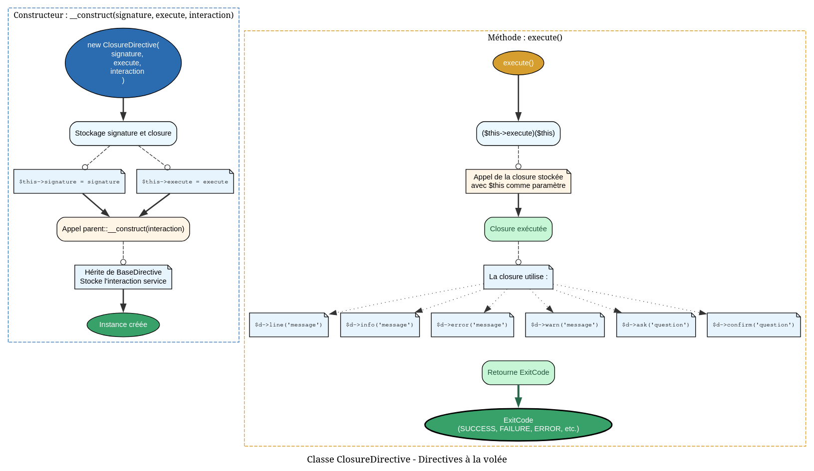

# ClosureDirective - Référence Technique

## Description

Directive de test qui exécute une closure au lieu d'une classe complète.

## Hiérarchie

```
AbstractDirective
    └── ClosureDirective
```

## Rôle principal

Permet de créer rapidement des directives pour les tests sans écrire de classes dédiées. La closure reçoit l'instance de la directive comme premier paramètre, donnant accès aux méthodes d'interaction (`line()`, `info()`, `error()`), aux arguments et aux options.

## Installation

```bash
composer require --dev andydefer/php-records
```

Cette classe est destinée uniquement à l'environnement de test.

```php
use AndyDefer\Directive\Testing\ClosureDirective;

$directive = new ClosureDirective(
    signature: 'test {name}',
    execute: fn($d) => $d->line('Hello ' . $d->argument('name')),
    interaction: $interaction
);
```

## API / Méthodes publiques

### `__construct(string $signature, callable $execute, DirectiveInteractionService $interaction): void`

| Paramètre | Type | Description |
|-----------|------|-------------|
| `$signature` | `string` | Signature de la directive |
| `$execute` | `callable(ClosureDirective): ExitCode` | Logique d'exécution sous forme de closure |
| `$interaction` | `DirectiveInteractionService` | Service d'interaction pour les sorties |

**Exemple :**
```php
$directive = new ClosureDirective(
    signature: 'greet {name}',
    execute: function ($d) {
        $d->line('Hello ' . $d->argument('name'));
        return ExitCode::SUCCESS;
    },
    interaction: $interaction
);
```

### `getSignature(): string`

**Retourne :** `string` - Signature de la directive

**Exemple :**
```php
$signature = $directive->getSignature(); // 'greet {name}'
```

### `getDescription(): string`

**Retourne :** `string` - Description par défaut de la directive de test

**Exemple :**
```php
$description = $directive->getDescription(); // 'Test directive created from closure'
```

### `execute(): ExitCode`

**Retourne :** `ExitCode` - Code de sortie retourné par la closure

Exécute la closure et retourne son résultat.

**Exemple :**
```php
$exitCode = $directive->execute(); // ExitCode::SUCCESS
```

## Cas d'utilisation

### Cas 1 : Directive simple avec affichage

```php
public function test_greeting_directive(): void
{
    $directive = new ClosureDirective(
        signature: 'greet {name}',
        execute: function ($d) {
            $name = $d->argument('name');
            $d->line("Hello, {$name}!");
            return ExitCode::SUCCESS;
        },
        interaction: $this->interaction
    );
    
    $this->registerDirective($directive);
    $response = $this->runDirective('greet', ['John']);
    
    $this->assertStringContainsString('Hello, John!', $response->output);
}
```

### Cas 2 : Directive avec options

```php
public function test_verbose_directive(): void
{
    $directive = new ClosureDirective(
        signature: 'process {--verbose}',
        execute: function ($d) {
            if ($d->hasOption('verbose')) {
                $d->info('Processing in verbose mode');
            }
            return ExitCode::SUCCESS;
        },
        interaction: $this->interaction
    );
    
    $response = $this->runDirective('process', ['--verbose']);
    
    $this->assertStringContainsString('verbose mode', $response->output);
}
```

### Cas 3 : Directive avec logique conditionnelle

```php
public function test_validation_directive(): void
{
    $directive = new ClosureDirective(
        signature: 'validate {age}',
        execute: function ($d) {
            $age = (int) $d->argument('age');
            
            if ($age < 18) {
                $d->error('Age must be at least 18');
                return ExitCode::INVALID_ARGUMENT;
            }
            
            $d->line('Valid age');
            return ExitCode::SUCCESS;
        },
        interaction: $this->interaction
    );
    
    $response = $this->runDirective('validate', ['16']);
    
    $this->assertSame(ExitCode::INVALID_ARGUMENT, $response->exitCode);
    $this->assertStringContainsString('must be at least 18', $response->output);
}
```

### Cas 4 : Test de différents codes de sortie

```php
public function test_error_handling(): void
{
    $directive = new ClosureDirective(
        signature: 'risky',
        execute: function ($d) {
            try {
                // Operation risquée
                throw new \Exception('Something went wrong');
            } catch (\Exception $e) {
                $d->error($e->getMessage());
                return ExitCode::FAILURE;
            }
        },
        interaction: $this->interaction
    );
    
    $response = $this->runDirective('risky');
    
    $this->assertSame(ExitCode::FAILURE, $response->exitCode);
    $this->assertStringContainsString('went wrong', $response->output);
}
```

### Cas 5 : Tests rapides sans créer de classes

```php
public function test_multiple_scenarios(): void
{
    $scenarios = [
        'addition' => fn($d) => $d->line('1 + 1 = 2'),
        'subtraction' => fn($d) => $d->line('5 - 3 = 2'),
        'multiplication' => fn($d) => $d->line('4 * 4 = 16'),
    ];
    
    foreach ($scenarios as $name => $logic) {
        $directive = new ClosureDirective(
            signature: $name,
            execute: $logic,
            interaction: $this->interaction
        );
        
        $this->registerDirective($directive);
        $response = $this->runDirective($name);
        
        $this->assertSame(ExitCode::SUCCESS, $response->exitCode);
    }
}
```

## Flux d'exécution



## Gestion des erreurs

| Situation | Code retour | Comportement |
|-----------|-------------|--------------|
| Closure retourne ExitCode::SUCCESS | `ExitCode::SUCCESS` | Exécution normale |
| Closure retourne ExitCode::FAILURE | `ExitCode::FAILURE` | Échec signalé |
| Closure retourne ExitCode::INVALID_ARGUMENT | `ExitCode::INVALID_ARGUMENT` | Argument invalide |
| Exception dans la closure | Non catchée | Remonte à l'appelant |

## Intégration

### Avec InteractsWithDirectives

```php
use AndyDefer\Directive\Testing\InteractsWithDirectives;

final class MyTest extends TestCase
{
    use InteractsWithDirectives;
    
    public function test_closure_directive(): void
    {
        $this->createTestDirective('ping', function ($d) {
            $d->line('Pong!');
            return ExitCode::SUCCESS;
        });
        
        $response = $this->runDirective('ping');
        
        $this->assertStringContainsString('Pong!', $response->output);
    }
}
```

### Avec createTestDirective() helper

Le trait `InteractsWithDirectives` fournit `createTestDirective()` qui encapsule la création :

```php
// Équivalent à :
$this->createTestDirective('test', function ($d) {
    $d->line('Hello');
    return ExitCode::SUCCESS;
});

// Manuellement :
$directive = new ClosureDirective(
    signature: 'test',
    execute: function ($d) {
        $d->line('Hello');
        return ExitCode::SUCCESS;
    },
    interaction: $this->interaction
);
$this->registerDirective($directive);
```

## Performance

- **Complexité :** O(1) - simple appel de closure
- **Mémoire :** Une instance de closure par directive
- **Tests :** Idéal pour les tests unitaires rapides

## Compatibilité

| Version PHP | Support |
|-------------|---------|
| PHP 8.1+ | ✅ Complet |
| PHP 8.0 | ✅ Complet |

## Exemple complet

```php
<?php

declare(strict_types=1);

namespace App\Tests\Unit;

use AndyDefer\Directive\Enums\ExitCode;
use AndyDefer\Directive\Testing\ClosureDirective;
use AndyDefer\Directive\Testing\InteractsWithDirectives;
use PHPUnit\Framework\TestCase;

final class CalculatorTest extends TestCase
{
    use InteractsWithDirectives;

    protected function setUp(): void
    {
        parent::setUp();
        $this->initDirectiveTesting();
    }

    protected function tearDown(): void
    {
        $this->destroyDirectiveTesting();
        parent::tearDown();
    }

    public function test_closure_directive_calculator(): void
    {
        // Création d'une directive calculatrice avec closure
        $calculator = new ClosureDirective(
            signature: 'calc {a} {b} {--operation=add}',
            execute: function ($d) {
                $a = (int) $d->argument('a');
                $b = (int) $d->argument('b');
                $operation = $d->option('operation', 'add');
                
                $result = match($operation) {
                    'add' => $a + $b,
                    'sub' => $a - $b,
                    'mul' => $a * $b,
                    'div' => $b !== 0 ? $a / $b : throw new \Exception('Division by zero'),
                    default => throw new \Exception("Unknown operation: {$operation}"),
                };
                
                $d->line("Result: {$result}");
                return ExitCode::SUCCESS;
            },
            interaction: $this->interaction
        );
        
        $this->registerDirective($calculator);
        
        // Test addition
        $response = $this->runDirective('calc', ['10', '5', '--operation=add']);
        $this->assertStringContainsString('Result: 15', $response->output);
        
        // Test multiplication
        $response = $this->runDirective('calc', ['6', '7', '--operation=mul']);
        $this->assertStringContainsString('Result: 42', $response->output);
        
        // Test division par zéro
        $response = $this->runDirective('calc', ['10', '0', '--operation=div']);
        $this->assertStringContainsString('Division by zero', $response->output);
    }
    
    public function test_create_test_directive_helper(): void
    {
        // Version plus concise avec createTestDirective()
        $this->createTestDirective('hello', function ($d) {
            $d->line('Hello World!');
            return ExitCode::SUCCESS;
        });
        
        $response = $this->runDirective('hello');
        
        $this->assertSame(ExitCode::SUCCESS, $response->exitCode);
        $this->assertStringContainsString('Hello World!', $response->output);
    }
}
```
---