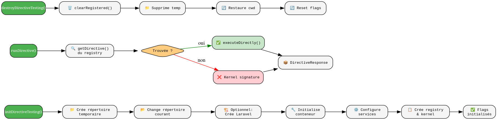

# InteractsWithDirectives - Référence Technique

## Description

Trait PHPUnit fournissant des méthodes utilitaires pour tester les directives dans un environnement isolé, sans dépendre du système de fichiers réel.

## Hiérarchie

```
PHPUnit\Framework\TestCase
    └── use InteractsWithDirectives
```

## Rôle principal

Permettre de tester les directives CLI de manière isolée et reproductible. Initialise un environnement de test avec un conteneur Laravel simulé, un kernel personnalisé, et un registry en mémoire pour les directives. Optionnellement, peut bootstraper une application Laravel minimale pour les tests nécessitant Eloquent ou la base de données.

## Installation

```bash
composer require --dev andydefer/laravel-directive
```

## API / Méthodes publiques

### `initDirectiveTesting(bool $bootLaravel = false): void`

Initialise l'environnement de test pour les directives.

| Paramètre | Type | Description |
|-----------|------|-------------|
| `$bootLaravel` | `bool` | Si `true`, crée une structure Laravel minimale |

**Exemple :**
```php
protected function setUp(): void
{
    parent::setUp();
    $this->initDirectiveTesting();
}
```

### `destroyDirectiveTesting(): void`

Détruit l'environnement de test et nettoie les fichiers temporaires.

**Exemple :**
```php
protected function tearDown(): void
{
    $this->destroyDirectiveTesting();
    parent::tearDown();
}
```

### `registerDirective(AbstractDirective $directive): void`

Enregistre une instance de directive pour les tests.

| Paramètre | Type | Description |
|-----------|------|-------------|
| `$directive` | `AbstractDirective` | Instance de la directive à tester |

**Exemple :**
```php
$directive = new UserListDirective($this->interaction);
$this->registerDirective($directive);
```

### `registerDirectives(array $directives): void`

Enregistre plusieurs instances de directives.

| Paramètre | Type | Description |
|-----------|------|-------------|
| `$directives` | `array<AbstractDirective>` | Tableau d'instances de directives |

### `clearRegisteredDirectives(): void`

Supprime toutes les directives enregistrées du registry.

### `createTestDirective(string $signature, callable $execute): ClosureDirective`

Crée une directive temporaire avec une closure comme logique d'exécution.

| Paramètre | Type | Description |
|-----------|------|-------------|
| `$signature` | `string` | Signature de la directive |
| `$execute` | `callable` | Fonction exécutée par la directive |

**Retourne :** `ClosureDirective` - Instance de la directive créée

**Exemple :**
```php
$this->createTestDirective('test-cmd', function ($d) {
    $d->line('Hello World');
    return ExitCode::SUCCESS;
});
```

### `runDirective(string $className, array $arguments = []): DirectiveResponse`

Exécute une directive par son FQCN (namespace complet).

| Paramètre | Type | Description |
|-----------|------|-------------|
| `$className` | `string` | FQCN de la directive (ex: `UserListDirective::class`) |
| `$arguments` | `array<string>` | Arguments à passer à la directive |

**Retourne :** `DirectiveResponse` - Objet contenant le code de sortie et la sortie

**Exemple :**
```php
$response = $this->runDirective(UserListDirective::class, ['--verbose']);
```

### `runAndAssert(string $className, array $arguments = []): DirectiveResponse`

Exécute une directive et vérifie automatiquement qu'elle a réussi.

| Paramètre | Type | Description |
|-----------|------|-------------|
| `$className` | `string` | FQCN de la directive |
| `$arguments` | `array<string>` | Arguments à passer |

**Retourne :** `DirectiveResponse` - Objet réponse pour assertions supplémentaires

**Exemple :**
```php
$this->runAndAssert(UserListDirective::class, ['--limit=10']);
```

### `getBufferLevel(): int`

Retourne le niveau actuel du buffer de sortie. Utile pour le debug.

## Cas d'utilisation

### Cas 1 : Tester une directive simple

```php
final class UserListDirectiveTest extends TestCase
{
    use InteractsWithDirectives;

    protected function setUp(): void
    {
        parent::setUp();
        $this->initDirectiveTesting();
    }

    public function test_directive_returns_success(): void
    {
        $directive = new UserListDirective($this->interaction);
        $this->registerDirective($directive);

        $response = $this->runDirective(UserListDirective::class);
        
        $response->assertSuccess();
        $this->assertStringContainsString('Users listed', $response->getOutput());
    }
}
```

### Cas 2 : Tester une directive avec arguments

```php
public function test_directive_with_arguments(): void
{
    $directive = new CalculatorDirective($this->interaction);
    $this->registerDirective($directive);

    $response = $this->runDirective(CalculatorDirective::class, ['add', '5', '3']);
    
    $response->assertSuccess();
    $this->assertStringContainsString('8', $response->getOutput());
}
```

### Cas 3 : Tester une directive avec Laravel

```php
public function test_directive_needing_database(): void
{
    $this->initDirectiveTesting(bootLaravel: true);
    
    $directive = new UserStatsDirective($this->interaction);
    $this->registerDirective($directive);
    
    $response = $this->runDirective(UserStatsDirective::class);
    $response->assertSuccess();
}
```

### Cas 4 : Tester avec une directive temporaire (closure)

```php
public function test_custom_behavior(): void
{
    $executed = false;
    
    $this->createTestDirective('test-cmd', function ($d) use (&$executed) {
        $executed = true;
        $d->line('Executed!');
        return ExitCode::SUCCESS;
    });
    
    $response = $this->runDirective('test-cmd');
    
    $this->assertTrue($executed);
    $response->assertSuccess();
}
```

## Flux d'exécution



## Gestion des erreurs

| Situation | Comportement |
|-----------|--------------|
| Directive non enregistrée | Fallback vers le kernel avec la signature |
| Exception dans `execute()` | Capturée, retourne `ExitCode::FAILURE` |
| Buffer de sortie non fermé | Nettoyé automatiquement dans le catch |
| Répertoire temporaire non créable | Exception PHP (mkdir échoue) |

## Intégration

Le trait `InteractsWithDirectives` s'intègre avec :

- **`TestDirectiveRegistry`** : Stockage en mémoire des directives
- **`DirectiveKernel`** : Kernel complet pour l'exécution
- **`DirectiveInteractionService`** : Service d'interaction utilisateur
- **`LaravelBootstrapper`** : Bootstrap optionnel de Laravel
- **`DirectiveResponse`** : Objet réponse pour les assertions

## Performance

| Aspect | Caractéristique |
|--------|----------------|
| Initialisation | Une fois par classe de test (via `setUp()`) |
| Nettoyage | Une fois par classe de test (via `tearDown()`) |
| Exécution d'une directive | ~10-50ms (selon complexité) |
| Bootstrap Laravel | ~200ms supplémentaire (une fois) |

## Compatibilité

| Version | Support |
|---------|---------|
| PHP 8.1+ | ✅ Requis |
| PHPUnit 10+ | ✅ Complet |
| Laravel 10+ | ✅ Optionnel (via `bootLaravel: true`) |

## Exemple complet

```php
<?php

declare(strict_types=1);

namespace Tests\Unit\Directives;

use AndyDefer\Directive\Enums\ExitCode;
use AndyDefer\Directive\Testing\InteractsWithDirectives;
use App\Directives\UserCreateDirective;
use PHPUnit\Framework\TestCase;

final class UserCreateDirectiveTest extends TestCase
{
    use InteractsWithDirectives;

    protected function setUp(): void
    {
        parent::setUp();
        $this->initDirectiveTesting();
    }

    protected function tearDown(): void
    {
        $this->destroyDirectiveTesting();
        parent::tearDown();
    }

    public function test_user_creation_success(): void
    {
        $directive = new UserCreateDirective($this->interaction);
        $this->registerDirective($directive);

        $response = $this->runDirective(
            UserCreateDirective::class,
            ['John Doe', 'john@example.com', '--role=admin']
        );

        $response
            ->assertSuccess()
            ->assertOutputContains('User created successfully')
            ->assertOutputContains('Role: admin');
    }

    public function test_user_creation_missing_name(): void
    {
        $directive = new UserCreateDirective($this->interaction);
        $this->registerDirective($directive);

        $response = $this->runDirective(UserCreateDirective::class, ['--role=admin']);

        $this->assertSame(ExitCode::INVALID_ARGUMENT, $response->getExitCode());
        $this->assertStringContainsString('Name is required', $response->getOutput());
    }

    public function test_user_creation_with_laravel(): void
    {
        $this->destroyDirectiveTesting();
        $this->initDirectiveTesting(bootLaravel: true);

        $directive = new UserCreateDirective($this->interaction);
        $this->registerDirective($directive);

        $response = $this->runDirective(UserCreateDirective::class, ['John', 'john@example.com']);
        $response->assertSuccess();
    }
}
```
---