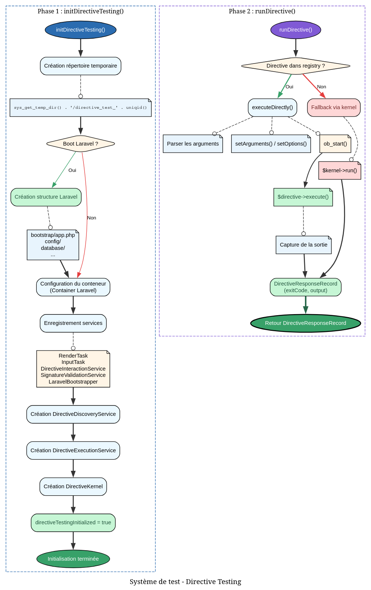

# InteractsWithDirectives - Référence Technique

## Description

Trait PHPUnit fournissant des utilitaires de test pour les directives, permettant un environnement isolé sans dépendance au système de fichiers.

## Hiérarchie

```
Trait PHPUnit
    └── InteractsWithDirectives
```

## Rôle principal

Ce trait permet de tester des directives dans un environnement totalement isolé. Il crée un répertoire temporaire, initialise l'ensemble des services nécessaires (kernel, discovery, execution) et offre des méthodes simples pour enregistrer et exécuter des directives pendant les tests.

## Installation

```bash
composer require --dev andydefer/php-records
```

Le trait s'utilise dans une classe PHPUnit :

```php
use AndyDefer\Directive\Testing\InteractsWithDirectives;

final class MyDirectiveTest extends TestCase
{
    use InteractsWithDirectives;
    
    protected function setUp(): void
    {
        parent::setUp();
        $this->initDirectiveTesting();
    }
    
    protected function tearDown(): void
    {
        $this->destroyDirectiveTesting();
        parent::tearDown();
    }
}
```

## API / Méthodes publiques

### `initDirectiveTesting(bool $bootLaravel = false): void`

| Paramètre | Type | Description |
|-----------|------|-------------|
| `$bootLaravel` | `bool` | Si `true`, bootstrap une application Laravel minimale |

Initialise l'environnement de test. Crée un répertoire temporaire, configure le conteneur de services et optionnellement Laravel.

**Exemple :**
```php
protected function setUp(): void
{
    parent::setUp();
    $this->initDirectiveTesting();
}
```

### `destroyDirectiveTesting(): void`

Détruit l'environnement de test et nettoie les fichiers temporaires.

**Exemple :**
```php
protected function tearDown(): void
{
    $this->destroyDirectiveTesting();
    parent::tearDown();
}
```

### `registerDirective(AbstractDirective $directive): void`

| Paramètre | Type | Description |
|-----------|------|-------------|
| `$directive` | `AbstractDirective` | Instance de directive à enregistrer |

Enregistre une directive pour les tests.

**Exemple :**
```php
$directive = new MyDirective();
$this->registerDirective($directive);
```

### `registerDirectives(array $directives): void`

| Paramètre | Type | Description |
|-----------|------|-------------|
| `$directives` | `array<AbstractDirective>` | Tableau de directives |

Enregistre plusieurs directives.

**Exemple :**
```php
$this->registerDirectives([$directive1, $directive2]);
```

### `clearRegisteredDirectives(): void`

Supprime toutes les directives enregistrées.

**Exemple :**
```php
$this->clearRegisteredDirectives();
```

### `createTestDirective(string $signature, callable $execute): ClosureDirective`

| Paramètre | Type | Description |
|-----------|------|-------------|
| `$signature` | `string` | Signature de la directive |
| `$execute` | `callable` | Logique d'exécution |

**Retourne :** `ClosureDirective` - La directive créée

Crée une directive temporaire avec une closure comme logique d'exécution.

**Exemple :**
```php
$this->createTestDirective('test:cmd', function ($d) {
    $d->line('Hello World');
    return ExitCode::SUCCESS;
});
```

### `runDirective(string $className, array $arguments = []): DirectiveResponseRecord`

| Paramètre | Type | Description |
|-----------|------|-------------|
| `$className` | `string` | Nom de la directive (signature ou FQCN) |
| `$arguments` | `array<string>`` | Arguments à passer |

**Retourne :** `DirectiveResponseRecord` - Réponse contenant le code de sortie et la sortie

Exécute une directive et retourne sa réponse.

**Exemple :**
```php
$response = $this->runDirective('calculator', ['add', '5', '3']);
$this->assertSame(ExitCode::SUCCESS, $response->exitCode);
```

### `getBufferLevel(): int`

**Retourne :** `int` - Niveau actuel du buffer de sortie

Utile pour déboguer les problèmes liés aux buffers.

## Cas d'utilisation

### Cas 1 : Test d'une directive simple

```php
public function test_calculator_adds_numbers(): void
{
    // Arrange
    $directive = new CalculatorDirective();
    $this->registerDirective($directive);
    
    // Act
    $response = $this->runDirective('calculator', ['add', '5', '3']);
    
    // Assert
    $this->assertSame(ExitCode::SUCCESS, $response->exitCode);
    $this->assertStringContainsString('8', $response->output);
}
```

### Cas 2 : Test avec directive temporaire

```php
public function test_custom_directive_logic(): void
{
    // Arrange
    $executed = false;
    
    $this->createTestDirective('test:ping', function ($d) use (&$executed) {
        $executed = true;
        $d->line('Pong!');
        return ExitCode::SUCCESS;
    });
    
    // Act
    $response = $this->runDirective('test:ping');
    
    // Assert
    $this->assertTrue($executed);
    $this->assertStringContainsString('Pong!', $response->output);
}
```

### Cas 3 : Test avec options

```php
public function test_directive_with_verbose_option(): void
{
    // Arrange
    $directive = new VerboseDirective();
    $this->registerDirective($directive);
    
    // Act
    $response = $this->runDirective('verbose:cmd', ['--verbose']);
    
    // Assert
    $this->assertStringContainsString('[DEBUG]', $response->output);
}
```

### Cas 4 : Test d'erreur

```php
public function test_division_by_zero_returns_error(): void
{
    // Arrange
    $directive = new CalculatorDirective();
    $this->registerDirective($directive);
    
    // Act
    $response = $this->runDirective('calculator', ['div', '10', '0']);
    
    // Assert
    $this->assertSame(ExitCode::INVALID_ARGUMENT, $response->exitCode);
    $this->assertStringContainsString('Division by zero', $response->output);
}
```

### Cas 5 : Test avec environnement Laravel

```php
public function test_directive_using_laravel_cache(): void
{
    // Arrange
    $this->initDirectiveTesting(bootLaravel: true);
    $directive = new CacheDirective();
    $this->registerDirective($directive);
    
    // Act
    $response = $this->runDirective('cache:get', ['user:123']);
    
    // Assert
    $this->assertSame(ExitCode::SUCCESS, $response->exitCode);
}
```

## Flux d'exécution


## Gestion des erreurs

| Situation | Code retour | Message |
|-----------|-------------|---------|
| Directive non trouvée | `ExitCode::NOT_FOUND` | `Directive not found: {name}` |
| Arguments invalides | `ExitCode::INVALID_ARGUMENT` | Message de l'exception |
| Exception pendant l'exécution | `ExitCode::FAILURE` | Message de l'exception |

## Intégration

### Avec TestCase PHPUnit

```php
use PHPUnit\Framework\TestCase;
use AndyDefer\Directive\Testing\InteractsWithDirectives;

final class MyTest extends TestCase
{
    use InteractsWithDirectives;
    
    protected function setUp(): void
    {
        parent::setUp();
        $this->initDirectiveTesting();
    }
    
    protected function tearDown(): void
    {
        $this->destroyDirectiveTesting();
        parent::tearDown();
    }
}
```

### Avec des mocks

```php
public function test_with_mocked_dependency(): void
{
    $mock = $this->createMock(UserRepository::class);
    $mock->method('find')->willReturn($user);
    
    $directive = new UserDirective($mock);
    $this->registerDirective($directive);
    
    $response = $this->runDirective('user:find', ['123']);
    
    $this->assertStringContainsString('John Doe', $response->output);
}
```

## Performance

- **Premier appel :** Création du répertoire temporaire et de tous les services (~10-20ms)
- **Appels suivants :** Service déjà initialisé, retour immédiat
- **Mémoire :** Stockage des directives enregistrées pendant la durée du test
- **Nettoyage :** `destroyDirectiveTesting()` supprime tout le répertoire temporaire

## Compatibilité

| Version PHP | Support |
|-------------|---------|
| PHP 8.1+ | ✅ Complet |
| PHP 8.0 | ✅ Complet |

| Version Laravel | Support (bootLaravel) |
|----------------|----------------------|
| Laravel 10.x | ✅ Complet |
| Laravel 11.x | ✅ Complet |

## Exemple complet

```php
<?php

declare(strict_types=1);

namespace App\Tests\Unit;

use AndyDefer\Directive\AbstractDirective;
use AndyDefer\Directive\Enums\ExitCode;
use AndyDefer\Directive\Testing\InteractsWithDirectives;
use PHPUnit\Framework\TestCase;

final class CalculatorTest extends TestCase
{
    use InteractsWithDirectives;

    protected function setUp(): void
    {
        parent::setUp();
        $this->initDirectiveTesting();
    }

    protected function tearDown(): void
    {
        $this->destroyDirectiveTesting();
        parent::tearDown();
    }

    public function test_addition(): void
    {
        $this->createTestDirective('calc', function ($d) {
            $d->line('Result: 42');
            return ExitCode::SUCCESS;
        });

        $response = $this->runDirective('calc');

        $this->assertSame(ExitCode::SUCCESS, $response->exitCode);
        $this->assertStringContainsString('42', $response->output);
    }

    public function test_with_multiple_registered_directives(): void
    {
        $this->createTestDirective('cmd:a', fn($d) => $d->line('A') | ExitCode::SUCCESS);
        $this->createTestDirective('cmd:b', fn($d) => $d->line('B') | ExitCode::SUCCESS);

        $responseA = $this->runDirective('cmd:a');
        $responseB = $this->runDirective('cmd:b');

        $this->assertStringContainsString('A', $responseA->output);
        $this->assertStringContainsString('B', $responseB->output);
    }

    public function test_clear_directives(): void
    {
        $this->createTestDirective('temp:cmd', fn($d) => ExitCode::SUCCESS);
        
        $response = $this->runDirective('temp:cmd');
        $this->assertSame(ExitCode::SUCCESS, $response->exitCode);
        
        $this->clearRegisteredDirectives();
        
        $response = $this->runDirective('temp:cmd');
        $this->assertSame(ExitCode::NOT_FOUND, $response->exitCode);
    }
}
```
---