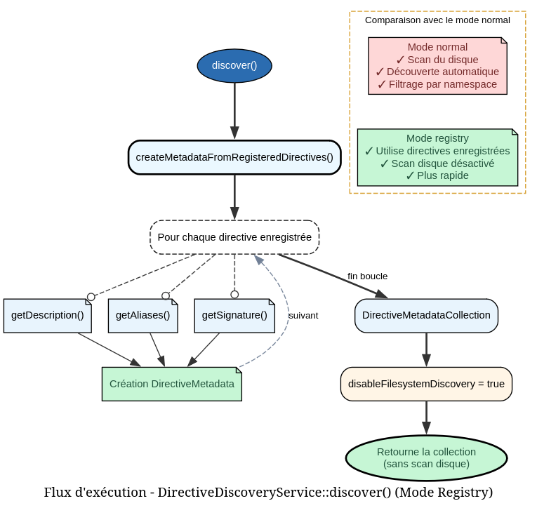
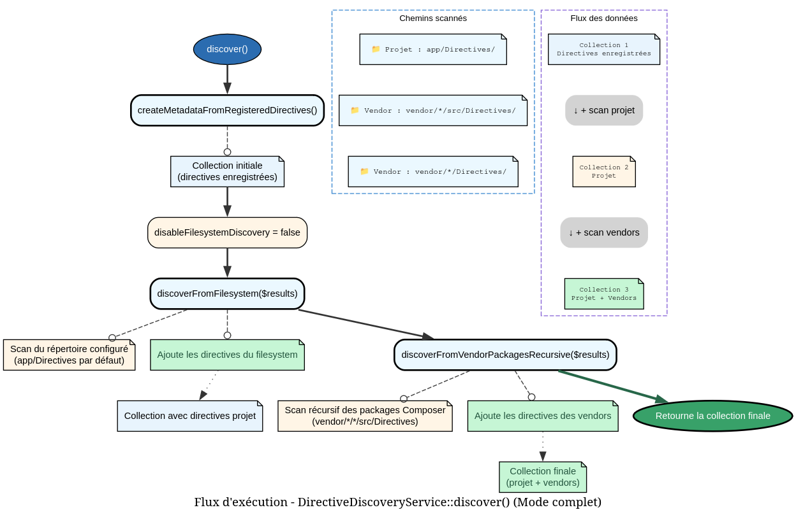

# TestDirectiveDiscoveryService - Référence Technique

## Description

Version spécialisée pour les tests du service de découverte de directives, permettant l'enregistrement programmatique sans exploration du système de fichiers.

## Hiérarchie

```
DirectiveDiscoveryService
    └── TestDirectiveDiscoveryService
```

## Rôle principal

Cette classe étend `DirectiveDiscoveryService` pour fournir un environnement de test contrôlé. Elle permet d'enregistrer des directives manuellement (via des instances ou des noms de classe) et peut désactiver la découverte automatique du système de fichiers, évitant ainsi les dépendances externes pendant les tests unitaires.

## Installation

```bash
composer require --dev andydefer/php-records
```

Cette classe est destinée uniquement à l'environnement de test.

```php
use AndyDefer\Directive\Testing\TestDirectiveDiscoveryService;

$service = new TestDirectiveDiscoveryService($config, $hydrator, true);
```

## API / Méthodes publiques

### `__construct(DirectiveConfig $config, DirectiveHydratorService $hydrator, bool $disableFilesystemDiscovery = true)`

| Paramètre | Type | Description |
|-----------|------|-------------|
| `$config` | `DirectiveConfig` | Configuration de la découverte |
| `$hydrator` | `DirectiveHydratorService` | Service d'hydratation |
| `$disableFilesystemDiscovery` | `bool` | Si `true`, désactive la découverte sur disque |

**Exemple :**
```php
$config = DirectiveConfig::default();
$hydrator = new DirectiveHydratorService();
$service = new TestDirectiveDiscoveryService($config, $hydrator, true);
```

### `registerDirective(AbstractDirective $directive): void`

| Paramètre | Type | Description |
|-----------|------|-------------|
| `$directive` | `AbstractDirective` | Instance de directive à enregistrer |

Enregistre une instance de directive dans le service de test.

**Exemple :**
```php
$directive = new UserCreateDirective();
$service->registerDirective($directive);
```

### `registerDirectives(array $directives): void`

| Paramètre | Type | Description |
|-----------|------|-------------|
| `$directives` | `array<AbstractDirective>` | Tableau de directives à enregistrer |

Enregistre plusieurs instances de directives.

**Exemple :**
```php
$directives = [new UserCreateDirective(), new CacheClearDirective()];
$service->registerDirectives($directives);
```

### `registerDirectiveClass(string $className, array $constructorArgs = []): AbstractDirective`

| Paramètre | Type | Description |
|-----------|------|-------------|
| `$className` | `class-string<AbstractDirective>` | Nom de la classe de directive |
| `$constructorArgs` | `array<mixed>` | Arguments du constructeur |

**Retourne :** `AbstractDirective` - Instance créée et enregistrée

Instancie une directive par son nom de classe et l'enregistre.

**Exemple :**
```php
$directive = $service->registerDirectiveClass(
    UserCreateDirective::class,
    [$dependency1, $dependency2]
);
```

### `clearRegisteredDirectives(): void`

Supprime toutes les directives précédemment enregistrées.

**Exemple :**
```php
$service->clearRegisteredDirectives();
$this->assertCount(0, $service->getRegisteredDirectives());
```

### `getRegisteredDirectives(): array`

**Retourne :** `array<AbstractDirective>` - Toutes les directives enregistrées

Récupère la liste des directives actuellement enregistrées.

**Exemple :**
```php
$directives = $service->getRegisteredDirectives();
foreach ($directives as $directive) {
    echo $directive->getSignature();
}
```

### `discover(): DirectiveMetadataCollection`

**Retourne :** `DirectiveMetadataCollection` - Collection des métadonnées des directives

Découvre les directives selon la configuration. Retourne soit uniquement les directives enregistrées, soit également celles du système de fichiers si activé.

**Exemple :**
```php
$metadata = $service->discover();
foreach ($metadata as $directive) {
    echo $directive->signature . ': ' . $directive->description;
}
```

## Cas d'utilisation

### Cas 1 : Test unitaire avec directives mockées

**Problème :** Tester un service qui dépend de la découverte de directives sans utiliser le vrai système de fichiers.

```php
class DirectiveExecutorTest extends TestCase
{
    private TestDirectiveDiscoveryService $discovery;
    
    protected function setUp(): void
    {
        $config = DirectiveConfig::default();
        $hydrator = $this->createMock(DirectiveHydratorService::class);
        $this->discovery = new TestDirectiveDiscoveryService($config, $hydrator, true);
    }
    
    public function test_execute_registered_directive(): void
    {
        // Arrange: Register mock directive
        $directive = $this->createMock(AbstractDirective::class);
        $directive->method('getSignature')->willReturn('test:cmd');
        $this->discovery->registerDirective($directive);
        
        // Act: Discover and execute
        $metadata = $this->discovery->discover();
        
        // Assert: Directive is found
        $this->assertCount(1, $metadata);
        $this->assertSame('test:cmd', $metadata->firstItem()->signature);
    }
}
```

### Cas 2 : Test de directives avec dépendances

**Problème :** Tester une directive qui a des dépendances à injecter.

```php
class UserDirectiveTest extends TestCase
{
    public function test_directive_with_dependencies(): void
    {
        // Arrange: Create dependencies
        $userRepository = $this->createMock(UserRepository::class);
        $mailer = $this->createMock(MailerService::class);
        
        // Register directive with constructor args
        $discovery = new TestDirectiveDiscoveryService($config, $hydrator, true);
        $directive = $discovery->registerDirectiveClass(
            CreateUserDirective::class,
            [$userRepository, $mailer]
        );
        
        // Act: Execute directive
        $result = $directive->execute(['name' => 'John']);
        
        // Assert: Verify behavior
        $this->assertTrue($result);
    }
}
```

### Cas 3 : Reset entre les tests

**Problème :** Éviter la pollution entre les tests en réinitialisant l'état.

```php
class DirectiveBatchTest extends TestCase
{
    private TestDirectiveDiscoveryService $discovery;
    
    protected function setUp(): void
    {
        parent::setUp();
        $this->discovery = new TestDirectiveDiscoveryService($config, $hydrator, true);
    }
    
    protected function tearDown(): void
    {
        $this->discovery->clearRegisteredDirectives();
        parent::tearDown();
    }
    
    public function test_first_scenario(): void
    {
        $this->discovery->registerDirective(new FirstDirective());
        $this->assertCount(1, $this->discovery->getRegisteredDirectives());
    }
    
    public function test_second_scenario(): void
    {
        // Collection is empty after tearDown
        $this->assertCount(0, $this->discovery->getRegisteredDirectives());
    }
}
```

### Cas 4 : Test de découverte avec filesystem activé

**Problème :** Tester l'interaction avec la découverte sur disque.

```php
class FilesystemDiscoveryTest extends TestCase
{
    public function test_discovery_with_filesystem_enabled(): void
    {
        // Arrange: Create service with filesystem discovery enabled
        $discovery = new TestDirectiveDiscoveryService($config, $hydrator, false);
        
        // Register a test directive
        $discovery->registerDirective(new TestDirective());
        
        // Act: Discover (should also scan filesystem)
        $metadata = $discovery->discover();
        
        // Assert: Contains both registered and filesystem directives
        $this->assertGreaterThanOrEqual(1, $metadata->count());
    }
}
```

### Cas 5 : Enregistrement batch depuis une configuration

**Problème :** Enregistrer plusieurs directives à partir d'une liste de classes.

```php
class DirectiveBatchRegistrationTest extends TestCase
{
    private array $directiveClasses = [
        UserCreateDirective::class,
        CacheClearDirective::class,
        ReportGenerateDirective::class,
    ];
    
    public function test_register_all_directives(): void
    {
        $discovery = new TestDirectiveDiscoveryService($config, $hydrator, true);
        
        foreach ($this->directiveClasses as $class) {
            $discovery->registerDirectiveClass($class, [$this->getCommonDependencies()]);
        }
        
        $directives = $discovery->getRegisteredDirectives();
        $this->assertCount(3, $directives);
        
        $signatures = array_map(
            fn($d) => $d->getSignature(), 
            $directives
        );
        
        $this->assertContains('user:create', $signatures);
        $this->assertContains('cache:clear', $signatures);
    }
}
```

## Flux d'exécution

### Découverte sans filesystem (mode test)


### Découverte avec filesystem activé



## Gestion des erreurs

| Situation | Comportement |
|-----------|--------------|
| Classe invalide dans `registerDirectiveClass()` | Exception `ReflectionException` |
| Arguments constructeur insuffisants | Exception `ReflectionException` |
| Directives en double | Accepté - plusieurs directives identiques possibles |
| Filesystem discovery activé sans droits lecture | Les erreurs de lecture sont ignorées silencieusement |

## Intégration

### Avec PHPUnit

```php
use AndyDefer\Directive\Testing\TestDirectiveDiscoveryService;

class CustomTestCase extends UnitTestCase
{
    protected TestDirectiveDiscoveryService $discovery;
    
    protected function setUp(): void
    {
        parent::setUp();
        $this->discovery = new TestDirectiveDiscoveryService(
            $this->config,
            $this->hydrator,
            true
        );
    }
    
    protected function registerTestDirective(string $class, array $args = []): AbstractDirective
    {
        return $this->discovery->registerDirectiveClass($class, $args);
    }
}
```

### Avec Mockery ou Prophecy

```php
use Mockery as m;

$directive = m::mock(AbstractDirective::class);
$directive->shouldReceive('getSignature')->andReturn('test:cmd');
$directive->shouldReceive('getDescription')->andReturn('Test command');

$discovery->registerDirective($directive);
```

### Pattern Builder pour les tests

```php
class DirectiveTestBuilder
{
    private TestDirectiveDiscoveryService $discovery;
    private array $directives = [];
    
    public function __construct(TestDirectiveDiscoveryService $discovery)
    {
        $this->discovery = $discovery;
    }
    
    public function withDirective(AbstractDirective $directive): self
    {
        $this->directives[] = $directive;
        return $this;
    }
    
    public function withClass(string $className, array $args = []): self
    {
        $this->discovery->registerDirectiveClass($className, $args);
        return $this;
    }
    
    public function build(): TestDirectiveDiscoveryService
    {
        $this->discovery->registerDirectives($this->directives);
        return $this->discovery;
    }
}

// Utilisation
$builder = new DirectiveTestBuilder($discovery);
$service = $builder
    ->withDirective(new UserDirective())
    ->withClass(CacheDirective::class, [$cache])
    ->build();
```

## Performance

- **Complexité temporelle :** O(n) où n est le nombre de directives enregistrées
- **Mémoire :** Stocke toutes les directives en mémoire pendant la durée du test
- **Mode filesystem :** Plus lent mais désactivé par défaut en test

### Benchmarks indicatifs

| Opération | 10 directives | 100 directives |
|-----------|---------------|----------------|
| `registerDirective()` | ~0.5 µs | ~5 µs |
| `registerDirectiveClass()` | ~5 µs | ~50 µs |
| `discover()` | ~1 µs | ~10 µs |

## Compatibilité

| Version PHP | Support |
|-------------|---------|
| PHP 8.1+ | ✅ Complet |
| PHP 8.0 | ✅ Complet |

## Exemple complet

```php
<?php

declare(strict_types=1);

use AndyDefer\Directive\AbstractDirective;
use AndyDefer\Directive\Config\DirectiveConfig;
use AndyDefer\Directive\Services\DirectiveHydratorService;
use AndyDefer\Directive\Testing\TestDirectiveDiscoveryService;
use AndyDefer\Directive\Tests\UnitTestCase;

// ==================== Définition de directives de test ====================

class UserCreateDirective extends AbstractDirective
{
    public function __construct(private UserRepository $users) {}
    
    public function getSignature(): string { return 'user:create'; }
    public function getDescription(): string { return 'Create a new user'; }
    public function getAliases(): array { return ['user:add']; }
    public function execute(array $params): void { /* ... */ }
}

class CacheClearDirective extends AbstractDirective
{
    public function getSignature(): string { return 'cache:clear'; }
    public function getDescription(): string { return 'Clear application cache'; }
    public function getAliases(): array { return ['cache:flush']; }
    public function execute(array $params): void { /* ... */ }
}

// ==================== Configuration ====================

$config = DirectiveConfig::default();
$hydrator = new DirectiveHydratorService();
$discovery = new TestDirectiveDiscoveryService($config, $hydrator, true);

// ==================== Enregistrement de directives ====================

echo "=== Registering Directives ===\n\n";

// Enregistrement par instance
$userDirective = new UserCreateDirective(new UserRepository());
$discovery->registerDirective($userDirective);
echo "✓ Registered UserCreateDirective instance\n";

// Enregistrement par classe
$cacheDirective = $discovery->registerDirectiveClass(CacheClearDirective::class);
echo "✓ Registered CacheClearDirective via class name\n";

// Enregistrement multiple
$discovery->registerDirectives([
    new TestDirective1(),
    new TestDirective2(),
]);
echo "✓ Registered multiple directives\n";

// ==================== Vérification ====================

echo "\n=== Registered Directives ===\n\n";

$directives = $discovery->getRegisteredDirectives();
echo sprintf("Total directives: %d\n\n", count($directives));

foreach ($directives as $directive) {
    echo sprintf(
        "  - %s (%s)\n",
        $directive->getSignature(),
        $directive::class
    );
}

// ==================== Découverte ====================

echo "\n=== Discovery Results ===\n\n";

$metadata = $discovery->discover();

foreach ($metadata as $item) {
    echo sprintf(
        "Signature: %s\nClass: %s\nDescription: %s\nAliases: %s\n\n",
        $item->signature,
        $item->class,
        $item->description ?? '(none)',
        implode(', ', $item->aliases)
    );
}

// ==================== Réinitialisation ====================

echo "=== Reset Demonstration ===\n\n";

echo "Before reset: " . count($discovery->getRegisteredDirectives()) . " directives\n";
$discovery->clearRegisteredDirectives();
echo "After reset: " . count($discovery->getRegisteredDirectives()) . " directives\n";

// ==================== Test avec filesystem activé ====================

echo "\n=== Filesystem Discovery Test ===\n\n";

$discoveryWithFs = new TestDirectiveDiscoveryService($config, $hydrator, false);
$discoveryWithFs->registerDirective($userDirective);

$allDirectives = $discoveryWithFs->discover();
echo sprintf(
    "Total directives (registered + filesystem): %d\n",
    $allDirectives->count()
);

// ==================== Intégration avec PHPUnit ====================

class ExampleTest extends UnitTestCase
{
    private TestDirectiveDiscoveryService $discovery;
    
    protected function setUp(): void
    {
        parent::setUp();
        $config = DirectiveConfig::default();
        $hydrator = $this->createMock(DirectiveHydratorService::class);
        $this->discovery = new TestDirectiveDiscoveryService($config, $hydrator, true);
    }
    
    protected function tearDown(): void
    {
        $this->discovery->clearRegisteredDirectives();
        parent::tearDown();
    }
    
    public function test_directive_registration(): void
    {
        // Arrange
        $directive = $this->createMock(AbstractDirective::class);
        $directive->method('getSignature')->willReturn('test:cmd');
        
        // Act
        $this->discovery->registerDirective($directive);
        
        // Assert
        $this->assertCount(1, $this->discovery->getRegisteredDirectives());
        
        $metadata = $this->discovery->discover();
        $this->assertSame('test:cmd', $metadata->firstItem()->signature);
    }
}

echo "\n✅ All examples completed successfully\n";
```
---